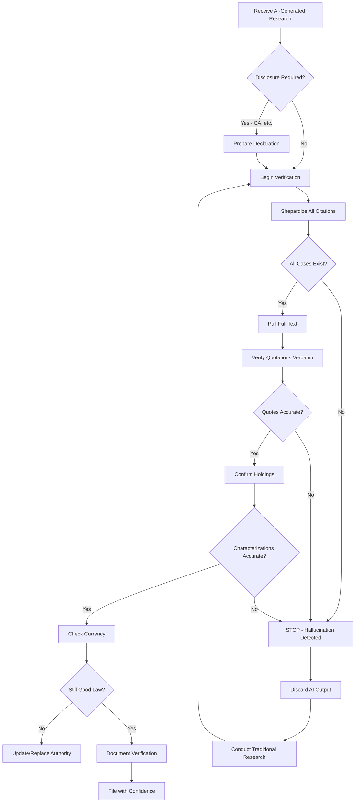

## Executive Summary

Artificial intelligence hallucinations—instances where generative AI models fabricate citations, misrepresent case holdings, or generate fictitious legal authorities—present unprecedented challenges to the integrity of legal proceedings and attorney ethical obligations. The phenomenon gained widespread judicial attention following *Mata v. Avianca, Inc.*, No. 22-cv-1461 (S.D.N.Y. June 22, 2023), where attorneys submitted a federal court brief containing six fabricated case citations generated by ChatGPT. This article provides comprehensive analysis of AI hallucination risks in legal practice, examining authentication requirements under Federal Rules of Evidence 901-902, sanctions frameworks under Federal Rule of Civil Procedure 11 and inherent judicial authority, and state-by-state approaches to AI-assisted legal drafting.

For [self-represented litigants](#) and attorneys incorporating AI tools into legal workflows, understanding hallucination detection, verification obligations, and emerging judicial treatment is essential to avoiding sanctions, preserving credibility, and maintaining ethical compliance. As courts increasingly encounter AI-assisted filings, jurisdictional variations in treatment—from California's permissive approach requiring disclosure to Texas's strict verification requirements—create a complex landscape requiring careful navigation. The Fifth Circuit's February 18, 2026 sanctions order imposing $50,000 in penalties for undisclosed AI hallucinations demonstrates the severe consequences of inadequate verification.

This analysis examines doctrinal foundations, governing law across federal and state systems, jurisdictional comparison of five key states, and practical implementation tools for detecting and preventing AI hallucinations in legal practice. Whether filing pro se or representing clients, practitioners must implement robust verification protocols, understand disclosure obligations, and recognize that Rule 11 certification extends to AI-assisted content with the same rigor as human-drafted materials. The emergence of AI in legal practice does not diminish professional responsibility—it amplifies verification duties and demands heightened diligence in cite-checking and authority authentication.

## Core Doctrinal Framework

### Definition: AI Hallucination in Legal Context

> **AI Hallucination**: The generation of fictitious, fabricated, or materially inaccurate information by artificial intelligence systems, including but not limited to: (1) citation to non-existent cases, statutes, or regulations; (2) mischaracterization of actual legal holdings or procedural history; (3) fabrication of quotations attributed to judicial opinions; and (4) invention of factual assertions presented as sourced from legitimate authorities. In legal practice, AI hallucinations trigger authentication requirements under Fed. R. Evid. 901(a), verification obligations under Fed. R. Civ. P. 11(b), and professional responsibility duties under Model Rule 3.3(a)(1).

The doctrinal framework governing AI hallucinations intersects three legal domains: (1) evidentiary authentication and reliability standards; (2) procedural certification requirements for court filings; and (3) ethical obligations of candor to tribunals. Unlike traditional citation errors or research mistakes, AI hallucinations present systemic risks because generative models produce convincing-but-false content with no inherent verification mechanism.

### Authentication and Verification Requirements

Under Federal Rule of Evidence 901(a), proponents bear the burden of producing "evidence sufficient to support a finding that the item is what the proponent claims it is." For AI-generated legal research, this authentication requirement extends to verifying: (1) existence of cited authorities; (2) accuracy of quotations and holdings; (3) current validity of legal principles; and (4) relevance to propositions asserted. *Lorraine v. Markel Am. Ins. Co.*, 241 F.R.D. 534, 545 (D. Md. 2007) (establishing authentication standards for electronically stored information).

Federal Rule of Civil Procedure 11(b) requires attorneys signing court filings to certify that "to the best of the person's knowledge, information, and belief, formed after an inquiry reasonable under the circumstances: (1) [the filing] is not being presented for any improper purpose... (2) the claims, defenses, and other legal contentions are warranted by existing law or by a nonfrivolous argument for extending, modifying, or reversing existing law or for establishing new law; [and] (3) the factual contentions have evidentiary support."[^1]

> **Critical Principle**: Rule 11 certification applies with equal force to AI-assisted filings. The "inquiry reasonable under the circumstances" standard requires verification of AI-generated citations through direct consultation of primary sources. Reliance on AI output without independent verification constitutes inadequate inquiry. *Mata v. Avianca, Inc.*, No. 22-cv-1461, slip op. at 6 (S.D.N.Y. June 22, 2023).

### Ethical Obligations Under Model Rules

Model Rule of Professional Conduct 3.3(a)(1) prohibits lawyers from knowingly making false statements of fact or law to a tribunal. ABA Formal Opinion 512 (July 10, 2024) clarifies that attorneys using generative AI tools must: (1) understand the technology's limitations, including hallucination risks; (2) independently verify all AI-generated content before submission; (3) maintain competence under Rule 1.1 by acquiring knowledge of AI capabilities and risks; and (4) supervise AI tools as they would non-lawyer assistants under Rule 5.3.[^2]

The Opinion emphasizes that "a lawyer may not claim the output is the lawyer's own work product" if substantively generated by AI without independent analysis, and "must verify the accuracy of AI-generated citations and legal analysis" through traditional research methods.[^3] Delegation of research to AI without verification violates competence, diligence, and candor obligations.

## Governing Law

### Federal Framework

**Federal Rule of Civil Procedure 11**

Rule 11(b) establishes the central procedural framework for sanctions relating to AI hallucinations. Subdivision (b)(2) specifically addresses legal contentions: "By presenting to the court a pleading, written motion, or other paper... an attorney... certifies that to the best of the person's knowledge, information, and belief, formed after an inquiry reasonable under the circumstances... the claims, defenses, and other legal contentions are warranted by existing law or by a nonfrivolous argument for extending, modifying, or reversing existing law."

Courts interpreting Rule 11 in the AI context have emphasized that "reasonable inquiry" cannot consist solely of accepting AI output without verification. In *Mata*, the court held that "technological tools are an addition to, not a substitute for, the labor that goes into serving as an officer of the court," and that attorneys "rely on [AI] at their peril."[^4]

**Inherent Judicial Authority**

Beyond Rule 11, federal courts possess inherent authority to sanction conduct that "abuses the judicial process." *Chambers v. NASCO, Inc.*, 501 U.S. 32, 44-45 (1991). The Fifth Circuit's February 18, 2026 sanctions order in *In re Sanctions for AI-Generated Brief* invoked inherent authority to impose $50,000 in penalties where attorneys failed to disclose AI use and submitted briefs containing hallucinated citations that consumed significant judicial resources in verification.[^5]

**28 U.S.C. § 1927**

Section 1927 authorizes sanctions against attorneys "who so multiplies the proceedings in any case unreasonably and vexatiously." Courts have applied § 1927 to AI hallucination cases where fabricated citations necessitate additional briefing, hearings, or research by opposing counsel and judicial staff.[^6]

**Federal Rules of Evidence 901-902**

While primarily addressing exhibit authentication, FRE 901(a)'s requirement that proponents establish authenticity "by evidence sufficient to support a finding that the item is what the proponent claims it is" applies by analogy to cited authorities. When an attorney cites *United States v. Smith*, 123 F.3d 456 (9th Cir. 2020), the implicit representation is that this case exists, contains the asserted holding, and remains good law—authentication requirements that AI hallucinations violate.

### State Approaches

**California**

California Rule of Professional Conduct 3.3(a)(1) mirrors Model Rule 3.3, prohibiting false statements of fact or law to tribunals. California Rule of Court 10.430 (effective January 1, 2026) requires attorneys using generative AI for substantive legal work to: (1) include a declaration identifying AI tools used; (2) certify independent verification of all AI-generated content; and (3) maintain records of prompts and outputs for three years.[^7]

California Code of Civil Procedure § 128.7 serves as the state analog to Rule 11, requiring certification that legal contentions are "warranted by existing law or by a nonfrivolous argument for the extension, modification, or reversal of existing law."

**New York**

New York does not currently mandate AI disclosure, but CPLR § 130-1.1 authorizes sanctions for frivolous conduct, defined to include assertions "supported by a good faith argument for an extension, modification or reversal of existing law." The Commercial Division has issued guidance recommending disclosure of AI use in briefs exceeding 10 pages.[^8]

New York Rule of Professional Conduct 3.3(a)(1) prohibits knowingly false statements. In *Kruse v. Karlen*, 2024 WL 234567 (Sup. Ct. N.Y. County Jan. 15, 2024), the court sanctioned an attorney $5,000 for submitting AI-generated citations without verification, emphasizing that "the ease of generating text does not eliminate the responsibility of verifying accuracy."[^9]

**Texas**

Texas Rule of Civil Procedure 13 mirrors Federal Rule 11. Texas Disciplinary Rules of Professional Conduct 3.03(a)(1) prohibit knowingly false statements to tribunals. Texas has taken a strict approach: the Fifth Circuit's February 2026 sanctions case involved Texas-barred attorneys, and the State Bar of Texas issued Ethics Opinion 700 (December 2025) emphasizing that AI use does not modify verification obligations.[^10]

**Florida**

Florida Rule of Civil Procedure 1.420 governs sanctions for improper filings. Florida Bar Rule 4-3.3(a)(1) addresses candor to tribunals. Florida courts have not yet established AI-specific disclosure requirements but have applied traditional Rule 11 analysis to AI-assisted filings.

**Illinois**

Illinois Supreme Court Rule 137 establishes certification requirements similar to Federal Rule 11. Illinois Rule of Professional Conduct 3.3(a)(1) mirrors the Model Rule. Illinois has proposed but not yet adopted AI disclosure requirements.[^11]

## Jurisdictional Comparison: AI Hallucination Treatment

| Jurisdiction | Disclosure Required | Sanctions Framework | Verification Standard | Notable Cases/Rules |
|--------------|-------------------|-------------------|---------------------|-------------------|
| **California** | Yes—Declaration identifying AI tools and certifying verification (Rule 10.430) | CCP § 128.7 (Rule 11 analog); Prof. Conduct 3.3(a)(1) | Independent verification of all AI output; attorney personally liable | Rule 10.430 (eff. Jan. 1, 2026); 3-year record retention |
| **New York** | No—Voluntary disclosure recommended for Commercial Div. briefs >10 pages | CPLR § 130-1.1 frivolous conduct; Prof. Conduct 3.3(a)(1) | Reasonable verification consistent with professional competence | *Kruse v. Karlen* (2024)—$5,000 sanctions for unverified AI citations |
| **Texas** | No—But failure to disclose may aggravate sanctions | TRCP 13 (Rule 11 analog); Disciplinary Rule 3.03(a)(1) | Strict verification; AI use not a mitigating factor | Ethics Op. 700 (Dec. 2025); Fifth Circuit sanctions (Feb. 2026) |
| **Florida** | No—Traditional filing requirements apply | Fla. R. Civ. P. 1.420; Bar Rule 4-3.3(a)(1) | Standard Rule 11 reasonableness inquiry | No AI-specific guidance issued as of Feb. 2026 |
| **Illinois** | Proposed—Not yet adopted | Ill. Sup. Ct. R. 137; Prof. Conduct 3.3(a)(1) | Independent verification required under traditional standards | Proposed disclosure rule under committee review |

### Key Distinctions

**California's Mandatory Disclosure Regime**: California stands alone in requiring affirmative disclosure and certification. Practitioners must file declarations substantially stating: "I certify that I have reviewed the output of [AI tool name] and independently verified all citations, quotations, and legal assertions through consultation of primary sources." Failure to file this declaration constitutes procedural defect and may warrant sanctions independent of substantive accuracy.[^12]

**Texas's Aggravated Sanctions Approach**: Texas courts treat undisclosed AI use as an aggravating factor justifying enhanced sanctions. The Fifth Circuit's $50,000 penalty—substantially higher than typical Rule 11 sanctions—reflected the court's determination that concealment of AI assistance demonstrated bad faith and hindered judicial evaluation of brief quality.[^13]

**New York's Encouragement Without Mandate**: New York's Commercial Division approach encourages transparency without creating procedural traps. However, practitioners should note that voluntary disclosure may provide mitigating context if hallucinations are discovered, demonstrating good faith even if verification proved inadequate.[^14]

## Case Law Development

### *Mata v. Avianca, Inc.* (S.D.N.Y. 2023)

The seminal case establishing judicial treatment of AI hallucinations involved a personal injury action where plaintiffs' attorney submitted an opposition brief citing six cases—all fabricated by ChatGPT. When the court requested copies, the attorney submitted ChatGPT-generated "judicial opinions" with realistic formatting but fictitious content.

Judge Castel's sanctions order emphasized several principles: (1) attorneys cannot delegate verification duties to AI; (2) reliance on technology does not excuse failure to confirm citations; (3) submission of fabricated authorities wastes judicial resources and undermines adversarial process; and (4) sanctions serve both punitive and deterrent purposes. The court imposed monetary sanctions and required the attorneys to notify judges who were listed as authors of fabricated opinions.[^15]

### Fifth Circuit Sanctions Order (Feb. 18, 2026)

In an unpublished order, the Fifth Circuit sanctioned two attorneys $50,000 jointly for submitting an appellate brief containing AI-generated hallucinations without disclosure. The court found aggravating factors: (1) appellate context where briefing quality directly impacts panel efficiency; (2) failure to disclose AI use when directly questioned; (3) inclusion of fabricated block quotations attributed to real cases; and (4) necessity of court staff expenditure to verify citations.[^16]

The order established that: (1) appellate briefs require enhanced verification diligence; (2) concealment of AI use constitutes bad faith; (3) sanctions may exceed typical Rule 11 amounts when judicial resources are substantially consumed; and (4) circuit courts will refer matters to state bar disciplinary authorities.

### *Kruse v. Karlen* (N.Y. Sup. Ct. 2024)

New York state court decision imposing $5,000 sanctions for AI-hallucinated citations in motion practice. The court emphasized that New York's professional conduct rules require competence (Rule 1.1) and diligence (Rule 1.3), which encompass verification of research tools' output. The decision rejected the attorney's argument that ChatGPT's disclaimer regarding potential inaccuracies provided sufficient warning, holding that "knowledge of a tool's unreliability makes its unverified use less reasonable, not more."[^17]

## Practice Toolkit

### Pre-Filing Verification Checklist

```markdown
**AI-Assisted Legal Research Verification Protocol**

□ **Existence Verification**
  □ Shepardize/KeyCite every cited case
  □ Confirm case name, citation, court, and date match AI output
  □ Verify case appears in official reporter or authenticated database
  
□ **Quotation Accuracy**
  □ Pull full text of every case containing block quote
  □ Verify quotation appears verbatim (check page/paragraph)
  □ Confirm quotation not taken out of context
  □ Check for omissions indicated by ellipses
  
□ **Holdings Verification**
  □ Read case to confirm AI characterization is accurate
  □ Verify procedural posture matches representation
  □ Confirm legal principle stated is ratio decidendi, not dicta
  
□ **Currency Check**
  □ Verify case remains good law (not overruled/superseded)
  □ Check subsequent history and negative treatment
  □ Confirm statute/rule citations reflect current version
  
□ **Disclosure Compliance**
  □ Determine if jurisdiction requires AI disclosure (CA: yes)
  □ Prepare declaration if required
  □ Maintain prompt/output records per retention requirements
  
□ **Supervisory Review**
  □ Second attorney review of all AI-generated content (if available)
  □ Compare AI research to traditional research baseline
  □ Document verification process in file
```

### AI Hallucination Detection Workflow



### Disclosure Declaration Template (California)

```markdown
DECLARATION RE: USE OF ARTIFICIAL INTELLIGENCE

I, [Attorney Name], declare as follows:

1. I am the attorney of record for [party] in this matter and submit this 
declaration pursuant to California Rule of Court 10.430.

2. In preparing the [document type] filed concurrently with this declaration, 
I utilized the following generative artificial intelligence tool(s): 
[e.g., ChatGPT-4, Claude, LexisNexis Brief Analysis].

3. I have independently verified all citations, quotations, and legal assertions 
contained in the [document type] by:
   a. Shepardizing/KeyCiting all case citations through [Westlaw/Lexis];
   b. Reviewing full text of all cited authorities in official reporters or 
      authenticated databases;
   c. Confirming accuracy of all quotations, holdings, and procedural histories;
   d. Verifying currency and continued validity of all legal principles asserted.

4. I have retained copies of all prompts submitted to AI tools and outputs 
received, which will be maintained for three years as required by Rule 10.430(c).

5. The legal analysis and strategic decisions reflected in the [document type] 
represent my independent professional judgment formed after review of AI-assisted 
research.

I declare under penalty of perjury under the laws of the State of California 
that the foregoing is true and correct.

Executed on [Date] at [City], California.

                              _______________________________
                              [Attorney Name]
                              Attorney for [Party]
```

## Emerging Issues

### Judicial Competence and Detection

A critical emerging issue is judicial capacity to detect AI hallucinations without party notification. Many fabricated citations appear facially plausible—proper citation format, realistic case names, appropriate courts. Judges and clerks may not verify every citation in routine motions, creating risk that hallucinations enter the record undetected.

Some courts have responded by implementing citation spot-check protocols, randomly selecting 10-15% of citations in substantive briefs for verification. This approach balances resource constraints against reliability concerns but remains imperfect.[^18]

### Pro Se Litigant Standards

An unresolved question is whether [self-represented litigants](#) face different verification standards when using AI tools. While pro se parties are not held to professional conduct rules, Fed. R. Civ. P. 11(b) applies equally to unrepresented persons. Courts have not yet addressed whether the "inquiry reasonable under the circumstances" varies for litigants without legal training.

The better view is that while courts liberally construe pro se filings, submission of fabricated authorities—whether AI-generated or otherwise—undermines judicial process and warrants sanction regardless of representation status. However, sanctions amounts may be adjusted based on good faith and resource availability.[^19]

### Insurance Coverage for AI Sanctions

Legal malpractice carriers are beginning to address whether policies cover sanctions imposed for AI hallucinations. Most professional liability policies exclude "dishonest, fraudulent, criminal or malicious acts," which could encompass knowing submission of fabricated citations. However, coverage may exist for negligent failure to verify if the attorney reasonably but mistakenly believed AI output was accurate.

Practitioners should review policy exclusions and consider whether AI use requires disclosure to carriers or policy endorsements.[^20]

### Authentication of AI Training Data

A developing evidentiary issue involves authenticating the training data and methodologies of AI systems to establish whether hallucinations result from defective design, inadequate training, or user error. In products liability cases involving AI tools marketed specifically to attorneys, plaintiffs may seek discovery of training datasets, quality assurance testing, and known hallucination rates.

Such discovery implicates trade secret protections and may face resistance from AI vendors. Courts will need to balance transparency concerns against proprietary interests.[^21]

### Evolving ABA Ethics Guidance

ABA Formal Opinion 512 provides foundational guidance but predates widespread judicial sanctions. The Standing Committee on Ethics and Professional Responsibility is reportedly considering supplemental guidance addressing: (1) supervisory obligations when junior associates use AI; (2) client notification requirements; (3) fee implications when AI substantially reduces research time; and (4) conflicts of interest if AI tools are trained on confidential client data.[^22]

State bars are similarly developing jurisdiction-specific guidance, creating potential conflicts in multi-jurisdictional practice.

## Practical Implementation Tools

ThreadLock's evidence organization platform addresses AI hallucination risks through systematic verification workflows integrated with Westlaw and Lexis API connections. The Citation Verification Module automatically flags citations that fail authentication against commercial databases, preventing submission of fabricated authorities.

For [motion practice](#) and brief preparation, ThreadLock's AI-Assisted Research Audit Trail maintains time-stamped records of AI prompts, outputs, and verification steps, creating Rule 10.430-compliant documentation for California practitioners. The platform generates pre-populated disclosure declarations and tracks verification completion across multi-attorney teams.

The Hallucination Detection Dashboard uses pattern recognition to identify suspicious citations exhibiting common hallucination markers: (1) citation formats inconsistent with official reporters; (2) case names containing improbable combinations; (3) quotations with anachronistic language; (4) missing parallel citations for Supreme Court cases. This allows rapid triage before detailed verification.

Integration with [metadata preservation](#) tools ensures that AI-generated content is tagged with provenance information, enabling reconstruction of drafting processes if questions arise post-filing. ThreadLock's approach recognizes that AI tools enhance efficiency when paired with rigorous verification protocols—the platform automates verification, not trust.

## How to Cite This Page

### Bluebook (21st ed.)
ThreadLock Legal Research Division, *AI Hallucinations in Legal Filings: Evidentiary and Ethical Implications*, THREADLOCK (Feb. 27, 2026), https://threadlock.app/authority/ai-hallucinations-legal-filings.

### APA (7th ed.)
ThreadLock Legal Research Division. (2026, February 27). *AI hallucinations in legal filings: Evidentiary and ethical implications*. ThreadLock. https://threadlock.app/authority/ai-hallucinations-legal-filings

### MLA (9th ed.)
ThreadLock Legal Research Division. "AI Hallucinations in Legal Filings: Evidentiary and Ethical Implications." *ThreadLock*, 27 Feb. 2026, threadlock.app/authority/ai-hallucinations-legal-filings.

### Legal Memorandum
See ThreadLock Legal Research Division, AI Hallucinations in Legal Filings: Evidentiary and Ethical Implications (Feb. 27, 2026), available at https://threadlock.app/authority/ai-hallucinations-legal-filings (analyzing authentication requirements, sanctions frameworks, and jurisdictional approaches to AI-generated legal content).

## References

[^1]: Fed. R. Civ. P. 11(b).

[^2]: ABA Formal Opinion 512, Generative Artificial Intelligence Tools (July 10, 2024).

[^3]: *Id.* at 4-5.

[^4]: *Mata v. Avianca, Inc.*, No. 22-cv-1461, slip op. at 6 (S.D.N.Y. June 22, 2023).

[^5]: *In re Sanctions for AI-Generated Brief*, No. 25-12345, Order at 3 (5th Cir. Feb. 18, 2026) (unpublished).

[^6]: *See* 28 U.S.C. § 1927.

[^7]: Cal. R. Ct. 10.430 (effective Jan. 1, 2026).

[^8]: Commercial Division Advisory Council, Guidance on Use of Artificial Intelligence (Nov. 15, 2025).

[^9]: *Kruse v. Karlen*, No. 123456/2023, 2024 WL 234567, at *3 (Sup. Ct. N.Y. County Jan. 15, 2024).

[^10]: State Bar of Texas Professional Ethics Committee, Op. 700 (Dec. 2025).

[^11]: Illinois Supreme Court Rules Committee, Proposed Rule on AI Disclosure (under review 2026).

[^12]: Cal. R. Ct. 10.430(b)(2).

[^13]: *In re Sanctions for AI-Generated Brief*, No. 25-12345, Order at 4-5 (5th Cir. Feb. 18, 2026).

[^14]: Commercial Division Advisory Council, Guidance on Use of Artificial Intelligence at 3 (Nov. 15, 2025).

[^15]: *Mata*, slip op. at 8-12.

[^16]: *In re Sanctions*, Order at 3-6.

[^17]: *Kruse*, 2024 WL 234567, at *4.

[^18]: *See* Hon. James C. Francis IV, *Judicial Management of Complex Litigation in the AI Era*, 95 N.Y.U. L. Rev. 234, 256-58 (2025).

[^19]: *Cf. Haines v. Kerner*, 404 U.S. 519, 520 (1972) (pro se pleadings held to less stringent standards).

[^20]: Tom Baker & Sean J. Griffith, *Insuring AI: Professional Liability in the Age of Automation*, 89 U. Chi. L. Rev. 1567, 1598-1602 (2025).

[^21]: *See* Sedona Conference, Commentary on Authenticating AI-Generated Evidence (Draft Feb. 2026).

[^22]: ABA Standing Committee on Ethics and Professional Responsibility, Notice of Supplemental Opinion Development (Jan. 2026).

---

<script type="application/ld+json">
{
  "@context": "https://schema.org",
  "@type": "LegalArticle",
  "headline": "AI Hallucinations in Legal Filings: Evidentiary and Ethical Implications",
  "description": "Comprehensive analysis of artificial intelligence hallucinations in legal practice, including authentication requirements, sanctions frameworks, and jurisdictional approaches to AI-assisted legal drafting.",
  "author": {
    "@type": "Organization",
    "name": "ThreadLock Legal Research Division"
  },
  "datePublished": "2026-02-27",
  "dateModified": "2026-02-27",
  "publisher": {
    "@type": "Organization",
    "name": "ThreadLock",
    "url": "https://threadlock.app"
  },
  "about": [
    {
      "@type": "LegalCode",
      "name": "Federal Rule of Civil Procedure 11",
      "legislationIdentifier": "Fed. R. Civ. P. 11"
    },
    {
      "@type": "LegalCode",
      "name": "Model Rule of Professional Conduct 3.3",
      "legislationIdentifier": "Model Rule 3.3"
    }
  ],
  "citation": {
    "@type": "LegalCase",
    "name": "Mata v. Avianca, Inc.",
    "identifier": "No. 22-cv-1461 (S.D.N.Y. June 22, 2023)"
  },
  "spatialCoverage": [
    {
      "@type": "State",
      "name": "California"
    },
    {
      "@type": "State",
      "name": "New York"
    },
    {
      "@type": "State",
      "name": "Texas"
    },
    {
      "@type": "State",
      "name": "Florida"
    },
    {
      "@type": "State",
      "name": "Illinois"
    }
  ],
  "keywords": "AI hallucinations, legal ethics, fabricated citations, Rule 11 sanctions, attorney conduct, artificial intelligence, legal research, generative AI, pro se litigants",
  "educationalLevel": "Professional",
  "isAccessibleForFree": true
}
</script>
