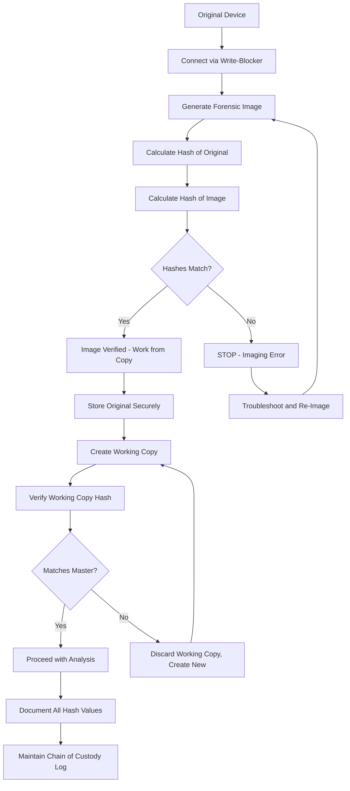

## Executive Summary

Chain of custody—the chronological documentation of evidence seizure, transfer, custody, control, analysis, and disposition—constitutes a critical evidentiary foundation for [digital exhibit admissibility](#), establishing that electronic files presented at trial remain identical to files collected from original sources without alteration, substitution, or contamination. While traditional chain of custody requirements developed for physical evidence (drugs, weapons, documents) translate imperfectly to digital contexts where files can be perfectly duplicated and remotely accessed, courts require proponents of digital evidence to demonstrate continuous accountability from collection through presentation, documenting each custodian, transfer, access point, and verification step to satisfy Federal Rule of Evidence 901(a) authentication requirements and prevent challenges of spoliation, fabrication, or manipulation under Federal Rule of Civil Procedure 37(e).

For [self-represented litigants](#) presenting digital evidence in family court custody disputes or civil litigation, understanding forensic collection methodology, hash verification protocols, documentation requirements, and testimony preparation transforms potentially excludable electronic exhibits into authenticated evidence capable of withstanding chain of custody challenges. The National Institute of Standards and Technology (NIST) Special Publication 800-86 and ISO/IEC 27037 international standards establish technical frameworks for forensically sound evidence collection, emphasizing write-blocking during imaging, cryptographic hash generation for integrity verification, and comprehensive audit trail maintenance—practices increasingly expected by courts evaluating [metadata as evidence](#) and digital file authentication.[^1]

This analysis examines doctrinal foundations of chain of custody requirements in digital contexts, forensic imaging and verification methodologies, authentication testimony frameworks, documentation standards, and practical implementation tools for maintaining evidentiary integrity from collection through trial. Whether preserving text messages from smartphones, extracting emails from cloud accounts, or documenting social media evidence, practitioners must implement protocols preventing allegations that evidence was altered, backdated, or fabricated. The emergence of encrypted devices, cloud storage, and blockchain-based evidence systems creates new challenges for establishing chain of custody while maintaining compliance with spoliation preservation duties under FRCP 37(e) and state analogs.

## Core Doctrinal Framework

### Definition: Digital Chain of Custody

> **Digital Chain of Custody**: The documented and verifiable chronological record of digital evidence handling from initial identification and collection through final disposition, establishing: (1) **Continuity of possession**—unbroken documentation of every person who had custody or control of evidence; (2) **Integrity verification**—technical demonstration through cryptographic hashing that files remain unaltered; (3) **Access accountability**—logging of every examination, copy, or analysis performed; and (4) **Transfer documentation**—records of each custody transfer with authentication of transferor and transferee. In digital contexts, chain of custody extends beyond physical device tracking to encompass forensic image verification, working copy generation, expert analysis, and trial exhibit preparation. *United States v. Safavian*, 435 F. Supp. 2d 36, 40-41 (D.D.C. 2006).

Digital chain of custody serves three evidentiary functions:

**Authentication**: Satisfying FRE 901(a) requirement that proponent produce "evidence sufficient to support a finding that the item is what the proponent claims it is." Chain of custody testimony establishes that exhibit presented at trial is the same evidence collected from source, without alteration.[^2]

**Reliability**: Demonstrating to fact-finder that evidence is trustworthy and untainted by contamination, substitution, or manipulation. Documented chain of custody addresses concerns about digital evidence malleability and ease of modification.[^3]

**Spoliation Defense**: Providing contemporaneous documentation that evidence was preserved using reasonable methods, protecting against allegations of destruction or alteration under FRCP 37(e) and inherent judicial authority sanctions frameworks.[^4]

### Distinctions from Physical Evidence Chain of Custody

Traditional chain of custody for physical evidence emphasizes preventing physical substitution or contamination through sealed containers, evidence lockers, and transfer logs. Digital evidence chain of custody confronts unique challenges:

**Perfect Duplication**: Digital files can be copied identically, making "original" vs. "copy" distinctions less meaningful than for physical evidence. Courts recognize forensically sound copies as equivalent to originals for evidentiary purposes.[^5]

**Remote Access**: Digital evidence can be examined without physical transfer through remote connections, networked storage, or cloud access. Chain of custody must document access points, not just physical possession.[^6]

**Metadata Modification**: File properties can change through routine computer operations (opening a file updates "last accessed" timestamp) even without content alteration. Forensic imaging captures metadata state at collection time; subsequent changes to working copies don't affect original image integrity if properly documented.[^7]

**Encryption Obstacles**: Password-protected devices and encrypted files may require forensic methods to access, with chain of custody documenting decryption procedures, key management, and verification that decryption didn't alter underlying data.[^8]

### Forensic Soundness Standard

Courts apply "forensic soundness" standard evaluating whether collection and preservation methods conform to accepted practices in digital forensics field. *Lorraine v. Markel American Insurance Co.*, 241 F.R.D. 534, 546 (D. Md. 2007), established factors for assessing forensic soundness:

1. **Methodology Documentation**: Written protocols describing collection procedures, tools used, and verification steps
2. **Qualification of Personnel**: Training and certification of individuals performing forensic collection
3. **Write Protection**: Use of hardware or software write-blockers preventing modification during imaging
4. **Hash Verification**: Generation of cryptographic signatures proving bit-for-bit accuracy of copies
5. **Audit Trail**: Comprehensive logging of all actions taken regarding evidence
6. **Industry Standards Compliance**: Adherence to NIST, ISO, or other recognized technical standards[^9]

Evidence collected using forensically sound methods receives presumption of reliability; evidence lacking forensic foundation faces heightened authentication burden and potential exclusion.[^10]

## Governing Law

### Federal Rules of Evidence

**Rule 901(a): Authentication Requirement**

"To satisfy the requirement of authenticating or identifying an item of evidence, the proponent must produce evidence sufficient to support a finding that the item is what the proponent claims it is."[^11]

Chain of custody constitutes primary method for authenticating digital evidence, though not always necessary. Courts may admit digital evidence based on distinctive characteristics, circumstantial evidence, or witness testimony even without comprehensive chain of custody if reliability is otherwise established.[^12]

**Rule 901(b): Authentication Methods**

Subdivision (b) provides non-exclusive list of authentication methods including:
- **(b)(1)**: Testimony of witness with knowledge that item is what it is claimed to be
- **(b)(4)**: Appearance, contents, substance, internal patterns, or distinctive characteristics
- **(b)(9)**: Evidence describing a process or system and showing it produces accurate result[^13]

Digital chain of custody typically combines methods: testimony of forensic examiner (b)(1)) describing imaging process (b)(9)) supplemented by hash values and metadata (b)(4)).

**Rule 902(13)-(14): Self-Authentication of Electronic Evidence**

2017 amendments permit self-authentication of electronic records and forensic copies through certification, reducing need for live testimony:

*Rule 902(13)*: Records generated by electronic process or system producing accurate results may be authenticated by certification complying with Rule 902(11) or (12).

*Rule 902(14)*: Data copied from electronic device, storage medium, or file may be authenticated by certification that copying process accurately reproduced the original.[^14]

Certifications must describe hash verification, imaging methodology, and chain of custody documentation. For [self-represented litigants](#), Rule 902(14) certification from commercial forensic services provides cost-effective authentication alternative to expert testimony.

### Federal Rules of Civil Procedure

**Rule 34(b): Production of ESI**

FRCP 34(b)(2)(E) establishes production obligations for electronically stored information: "Ordinarily, a party must produce documents as they are kept in the usual course of business or must organize and label them to correspond to the categories in the request."[^15]

Producing party must maintain chain of custody when extracting and producing responsive ESI to ensure materials provided to opposing party match source files. Hash verification and metadata preservation demonstrate compliance.[^16]

**Rule 37(e): Failure to Preserve ESI**

FRCP 37(e) governs sanctions for spoliation of electronically stored information: "If electronically stored information that should have been preserved in the anticipation or conduct of litigation is lost because a party failed to take reasonable steps to preserve it, and it cannot be restored or replaced through additional discovery, the court... may order measures no greater than necessary to cure the prejudice."[^17]

Chain of custody documentation demonstrates "reasonable steps to preserve" were taken, providing spoliation defense. Absence of chain of custody may support inference that evidence was destroyed or altered.[^18]

### Technical Standards

**NIST SP 800-86: Guide to Integrating Forensic Techniques into Incident Response**

Federal government standard establishing forensic imaging protocols:
- **Collection**: Use write-blockers; document hardware/software configurations; photograph equipment before seizure
- **Examination**: Generate cryptographic hashes; maintain forensic images as evidence; work from copies
- **Analysis**: Document all examinations; maintain logs of search parameters and tools used
- **Reporting**: Prepare comprehensive reports describing methodology, findings, and conclusions[^19]

**ISO/IEC 27037: Guidelines for Identification, Collection, Acquisition and Preservation of Digital Evidence**

International standard providing principles for digital evidence handling:
- **Relevance**: Collect potentially relevant evidence proportionate to case significance
- **Reliability**: Use methods ensuring evidence authenticity and integrity
- **Sufficiency**: Collect adequate evidence to support factual determinations
- **Auditability**: Maintain documentation enabling independent verification of procedures[^20]

**NIJ Electronic Crime Scene Investigation Guide**

National Institute of Justice guidelines for law enforcement applicable to civil litigation:
- **First responder procedures**: Secure scene; prevent contamination; document initial state
- **Collection methodology**: Photograph devices; document connections and settings; use forensic tools
- **Packaging and transport**: Avoid magnetic fields, static electricity, temperature extremes
- **Chain of custody forms**: Document every transfer with signatures, dates, case identifiers[^21]

## Forensic Collection Methodology

### Device Imaging Procedures

**Write-Blocking**

Critical first step preventing any modification to original evidence media. Write-blockers (hardware devices or software utilities) allow read-only access to storage devices, ensuring imaging process doesn't alter data:

- **Hardware write-blockers**: Physical devices connected between evidence drive and forensic workstation, mechanically preventing write commands
- **Software write-blockers**: Operating system utilities (e.g., Windows Registry modifications, Linux mount options) configured to prohibit writes
- **Verification**: Test write-blocker before imaging to confirm functionality[^22]

**Bit-by-Bit Imaging**

Sector-level copying of entire storage device including:
- Active files (currently accessible through operating system)
- Deleted files (marked for deletion but not yet overwritten)
- Slack space (partial sectors at file ends)
- Unallocated space (sectors containing remnants of deleted files)
- System areas (boot sectors, file allocation tables, metadata)[^23]

**Forensic Image Formats**

Standard formats preserving evidence integrity:
- **E01/EWF (Expert Witness Format)**: EnCase proprietary format with built-in compression, error correction, and metadata storage
- **AFF (Advanced Forensic Format)**: Open-source format supporting encryption and extensible metadata
- **DD (Raw Image)**: Bit-for-bit copy without compression; largest file size but maximum compatibility[^24]

### Hash Verification

**Cryptographic Hash Functions**

Mathematical algorithms generating unique fixed-length "fingerprints" of files or disk images:

**MD5 (Message Digest 5)**: 128-bit hash value. Fast computation but vulnerable to collision attacks (two different files producing same hash). Courts still widely accept MD5 despite theoretical weaknesses.[^25]

**SHA-1 (Secure Hash Algorithm 1)**: 160-bit hash. More secure than MD5 but also vulnerable to advanced collision attacks. Federal agencies transitioning away from SHA-1.[^26]

**SHA-256**: 256-bit hash providing strong collision resistance. Current federal standard; increasingly required for high-stakes litigation.[^27]

**Hash Verification Workflow**



### Mobile Device Forensics

Smartphones present unique challenges:
- **Encryption**: Most modern devices encrypt data at rest; forensic access may require passcode, biometric authentication, or specialized tools
- **Cloud synchronization**: Evidence may exist on device and in cloud; both sources must be preserved
- **App-specific storage**: Messaging apps (Signal, WhatsApp) use proprietary storage formats
- **Continuous data generation**: Devices receive messages and updates during collection; timing of imaging critical[^28]

**Cellebrite and Similar Tools**: Commercial mobile forensic platforms extract data from locked devices, generate reports, and calculate hash values. Courts generally accept Cellebrite evidence with proper foundation testimony.[^29]

**Logical vs. Physical Extraction**:
- **Logical extraction**: Accesses user data through device's operating system; faster but may miss deleted data
- **Physical extraction**: Bit-level imaging of device storage; more comprehensive but requires advanced tools and expertise[^30]

### Cloud-Based Evidence

Evidence stored in cloud services (Gmail, Google Drive, Dropbox, iCloud) requires different collection approaches:

**Preservation Letters**: Formal requests to service providers to preserve account data pending subpoena or production order.[^31]

**Account Exports**: Many platforms provide user-initiated export functions (Google Takeout, Facebook Download Your Information). Exports include metadata but may lack forensic verification.[^32]

**Legal Process**: Subpoenas or court orders compel service providers to produce account contents. Provider-generated productions often include authentication certifications satisfying FRE 902(14).[^33]

**Chain of Custody Challenges**: Multiple copies may exist (device, cloud server, backup locations). Documentation must identify which copy forms evidentiary basis and demonstrate consistency across versions.[^34]

## Documentation and Testimony Requirements

### Chain of Custody Log Template

```markdown
DIGITAL EVIDENCE CHAIN OF CUSTODY

Case Name: [Case Name]
Case Number: [Number]
Evidence Description: [Device type, serial number, or file description]
Collection Date/Time: [MM/DD/YYYY HH:MM]
Collection Location: [Physical address or account identifier]

HASH VALUES (Generated at Collection):
MD5: [32-character hexadecimal]
SHA-256: [64-character hexadecimal]

CUSTODY RECORD:

Transfer #1
Date/Time: [MM/DD/YYYY HH:MM]
Released By: [Name, Title]
Received By: [Name, Title]
Purpose: [Collection/Transport/Analysis/Storage/Return]
Method: [Hand delivery/Shipping/Electronic transfer]
Condition: [Sealed/Unsealed; Any visible damage]
Location: [Where evidence maintained]
Signatures: ___________________ / ___________________

Transfer #2
[Repeat fields for each transfer]

ACCESS LOG:

Access #1
Date/Time: [MM/DD/YYYY HH:MM]
Accessed By: [Name, Title]
Purpose: [Examination/Analysis/Copying/Verification]
Tools Used: [Software/Hardware]
Actions Taken: [Specific procedures performed]
Hash Verification: [Post-access hash matches original: Yes/No]
Notes: [Observations, findings, issues]
Signature: ___________________

[Continue for each access]

FINAL DISPOSITION:

Returned to: [Name/Entity]
Date: [MM/DD/YYYY]
Condition: [Description]
Method: [Hand delivery/Destruction/Continued storage]
Authorized by: [Name, Title]
Signature: ___________________
```

### Authentication Testimony Framework

Effective foundation testimony for digital evidence with chain of custody:

```markdown
DIGITAL EVIDENCE AUTHENTICATION EXAMINATION OUTLINE

QUALIFICATION OF WITNESS
Q: What is your occupation?
A: [Digital forensic examiner / IT professional / Custodian of records]

Q: What training have you received in digital forensics?
A: [Certifications: EnCE, ACE, GCFE; Formal education; Years of experience]

Q: How many times have you performed forensic imaging of [device type]?
A: [Number of examinations]

IDENTIFICATION OF EVIDENCE
Q: What is Exhibit [X]?
A: [DVD containing forensic image of / Printed report from / Screenshot of]

Q: When did you collect this evidence?
A: [Date and time of collection]

Q: From what source?
A: [Specific device, account, or location with identifying details]

COLLECTION METHODOLOGY
Q: Describe your collection procedure.
A: I connected the [device] to my forensic workstation using a [hardware write-blocker model]. 
   I then used [forensic software name] to create a bit-by-bit forensic image in [E01/DD] format.
   
Q: What is a write-blocker?
A: A hardware device that prevents any data from being written to the evidence device,
   ensuring my examination doesn't alter the original evidence.
   
Q: Did you verify the write-blocker was functioning?
A: Yes, I performed a test write to confirm the blocker prevented modifications.

HASH VERIFICATION
Q: How do you know the forensic image accurately captured the original data?
A: I generated cryptographic hash values—specifically MD5 and SHA-256—of both the original
   device and the forensic image. The hash values matched exactly, confirming bit-for-bit accuracy.
   
Q: What is a hash value?
A: A mathematical "fingerprint" unique to a specific set of data. Any change, even one bit,
   produces a completely different hash. Matching hashes prove identity.
   
Q: What were the hash values?
A: [State MD5 and SHA-256 values from documentation]

CHAIN OF CUSTODY
Q: What happened to the evidence after collection?
A: I sealed the original [device] in evidence bag [number], which I personally transported
   to [evidence storage location]. I retained the forensic image on my secured forensic server.
   
Q: Has the forensic image been altered since creation?
A: No. I maintain it on a read-only server and verify the hash value before any examination.
   The hash value I calculated today [state value] matches the original, confirming no alteration.
   
Q: Did you create copies for analysis?
A: Yes, I created a working copy from the master image and verified its hash matched before
   performing any searches or analysis.

EXHIBIT FOUNDATION
Q: Is Exhibit [X] a true and accurate [copy of / report based on] the evidence you collected?
A: Yes. I generated Exhibit [X] from the verified forensic image and can confirm through
   [hash verification / metadata comparison / personal knowledge] that it accurately represents
   the evidence from [source].

RELIABILITY
Q: Could the evidence have been altered between collection and today?
A: No. The matching hash values prove the forensic image remains identical to the original
   device contents. The chain of custody log shows continuous accountability with no gaps.
```

For [self-represented litigants](#) unable to afford forensic examiners, simplified authentication may suffice for routine digital evidence:

```markdown
SIMPLIFIED PRO SE DIGITAL EVIDENCE AUTHENTICATION

"On [date], I used [screenshot tool/phone camera/download function] to capture 
this [text message/email/social media post/document]. I [saved/photographed] it 
immediately without any editing or alteration. The image shows [describe visible 
timestamps, sender information, or other identifying features]. I have maintained 
this file on my [computer/phone/cloud storage] since [date] without making any 
changes. To verify this, I can show that the file properties indicate it was 
created on [date matching collection] and has not been modified since."
```

## Best Practices for Self-Represented Litigants

### Immediate Evidence Preservation Checklist

```markdown
DIGITAL EVIDENCE PRESERVATION - FIRST STEPS

□ **Stop Using Device** (if collecting from phone/computer)
  □ Power off to prevent automatic updates/deletions
  □ Remove from network to prevent remote wiping
  □ Photograph device showing current state and any visible content
  
□ **Create Immediate Backup**
  □ Screenshot or photograph visible evidence
  □ Note date/time of preservation
  □ Save to secure location (external drive, cloud with backup)
  
□ **Document Context**
  □ Write down when evidence was discovered
  □ Note who has had access to device/account
  □ Record any unusual circumstances
  □ Identify witnesses to evidence collection
  
□ **Preserve Metadata**
  □ Do not forward emails (creates new metadata)
  □ Do not copy/paste text messages (loses timestamp)
  □ Save files in native format, not converted to PDF
  □ Export full message threads, not individual texts
  
□ **Secure Originals**
  □ Store device in safe location
  □ Limit access to evidence
  □ Consider professional forensic imaging if case is high-stakes
  □ Maintain log of everyone who views evidence
  
□ **Create Working Copies**
  □ Never work from original files
  □ Make copies for review and analysis
  □ Keep originals untouched and secured
  □ Verify copies match originals (compare file sizes, timestamps)
```

### Screenshot Authentication Protocol

For [self-represented litigants](#) documenting social media, text messages, or online content:

```markdown
SCREENSHOT BEST PRACTICES

CAPTURE REQUIREMENTS:
□ Include full context (entire message thread, not isolated messages)
□ Show timestamps, sender identifications, platform indicators
□ Capture URL address bar for websites
□ Include visible account settings confirming ownership
□ Photograph screen with another device if authenticating device screenshots
  (shows screenshot is contemporaneous with event, not created later)

METADATA PRESERVATION:
□ Save screenshot file in original format (PNG, JPEG)
□ Do not edit or crop (maintains file metadata)
□ Note exact time screenshot was taken
□ Record device used and operating system

CORROBORATION:
□ Screenshot related content (profile pages showing account ownership)
□ Preserve underlying communication if accessible (native message file)
□ Identify witnesses who can verify content
□ Document how you accessed content (logged into account, public post, etc.)

ORGANIZATION:
□ Use descriptive file names: "2026-02-27_OpposingParty_Text_re_PickupTime.png"
□ Store chronologically
□ Maintain index of screenshots with descriptions
□ Keep originals separate from working copies
```

### Commercial Forensic Services

For cases requiring professional documentation, several services provide affordable forensic imaging:

**Evidence.com (Axon)**: Cloud-based evidence management with audit trails and hash verification. Designed for law enforcement but accessible to civil litigants.[^35]

**Page Vault**: Website archiving service capturing web pages with authentication certificates. Useful for preserving social media evidence before deletion.[^36]

**X1 Social Discovery**: E-discovery platform extracting social media, cloud storage, and mobile data with metadata preservation and chain of custody documentation.[^37]

**Local Forensic Labs**: Many cities have computer forensic firms offering device imaging services ($200-500 per device) with expert reports suitable for FRE 902(14) certification.[^38]

## Emerging Issues

### Blockchain-Based Evidence Verification

Distributed ledger technologies offer immutable timestamp verification and chain of custody tracking. Some jurisdictions are piloting blockchain systems for court filings and evidence management, creating cryptographically verifiable audit trails.[^39]

### Ransomware and Evidence Preservation

Ransomware attacks encrypting organizational data create chain of custody challenges when evidence is recovered through decryption. Courts must determine whether decrypted files constitute "originals" and what documentation satisfies authentication requirements.[^40]

### Right-to-Repair and Locked Devices

Manufacturer device locks and encryption impede forensic access. Legal battles over right-to-repair legislation and law enforcement backdoors affect civilian litigation when evidence is trapped in inaccessible devices.[^41]

### Automated Evidence Collection

Internet of Things (IoT) devices, smart home systems, and wearable technology generate continuous data streams. Establishing chain of custody for automatically collected evidence requires new frameworks addressing device reliability, data synchronization, and timestamp verification.[^42]

### Deepfake Detection

As AI-generated images and videos proliferate, chain of custody documentation must address content authenticity beyond file integrity. Even unaltered files may contain fabricated content, requiring multi-layer verification.[^43]

## Practical Implementation Tools

ThreadLock's Digital Chain of Custody Manager automates documentation and hash verification processes, eliminating manual logging errors and ensuring forensically sound evidence handling. The platform generates custody logs with electronic signatures, timestamps each transfer and access event, and maintains immutable audit trails suitable for court presentation.

The integrated Hash Verification Module calculates MD5, SHA-1, and SHA-256 values for uploaded files, automatically comparing working copies against master images to detect any alterations. Alert systems notify users if hash verification fails, preventing presentation of compromised evidence.

For [self-represented litigants](#) without forensic expertise, ThreadLock's Screenshot Authentication Tool captures screen images with embedded metadata including capture timestamp, device information, and browser details, generating packages ready for FRE 902(14) certification. The platform's Export function creates authenticated exhibits with chain of custody declarations suitable for pro se filing.

Integration with commercial forensic imaging services enables direct import of forensically sound evidence with preserved metadata and expert certifications. ThreadLock maintains comprehensive documentation of every evidence access, modification, and export, creating defensible records protecting against spoliation allegations under FRCP 37(e).

## How to Cite This Page

### Bluebook (21st ed.)
ThreadLock Legal Research Division, *Chain of Custody for Digital Files: Forensic Standards and Legal Requirements*, THREADLOCK (Feb. 27, 2026), https://threadlock.app/authority/chain-of-custody-digital-files.

### APA (7th ed.)
ThreadLock Legal Research Division. (2026, February 27). *Chain of custody for digital files: Forensic standards and legal requirements*. ThreadLock. https://threadlock.app/authority/chain-of-custody-digital-files

### MLA (9th ed.)
ThreadLock Legal Research Division. "Chain of Custody for Digital Files: Forensic Standards and Legal Requirements." *ThreadLock*, 27 Feb. 2026, threadlock.app/authority/chain-of-custody-digital-files.

### Legal Memorandum
See ThreadLock Legal Research Division, Chain of Custody for Digital Files: Forensic Standards and Legal Requirements (Feb. 27, 2026), available at https://threadlock.app/authority/chain-of-custody-digital-files (analyzing forensic imaging protocols, hash verification methodology, authentication testimony, and documentation standards for digital evidence chain of custody).

## References

[^1]: NIST Special Publication 800-86, Guide to Integrating Forensic Techniques into Incident Response (Aug. 2006); ISO/IEC 27037:2012, Guidelines for identification, collection, acquisition and preservation of digital evidence.

[^2]: Fed. R. Evid. 901(a).

[^3]: *United States v. Safavian*, 435 F. Supp. 2d 36, 40-41 (D.D.C. 2006).

[^4]: Fed. R. Civ. P. 37(e).

[^5]: Fed. R. Evid. 1001(d) ("If data are stored in a computer or similar device, any printout or other output readable by sight that accurately reflects the data is an 'original.'").

[^6]: *Lorraine v. Markel Am. Ins. Co.*, 241 F.R.D. 534, 546 (D. Md. 2007).

[^7]: *United States v. Browne*, 834 F.3d 403, 410 (3d Cir. 2016).

[^8]: *United States v. Fricosu*, 841 F. Supp. 2d 1232, 1237 (D. Colo. 2012).

[^9]: *Lorraine*, 241 F.R.D. at 546-47.

[^10]: *United States v. Zhyltsou*, 889 F.3d 389, 395-96 (4th Cir. 2018).

[^11]: Fed. R. Evid. 901(a).

[^12]: *Griffin v. State*, 419 Md. 343, 362-65, 19 A.3d 415, 427-29 (2011).

[^13]: Fed. R. Evid. 901(b)(1), (4), (9).

[^14]: Fed. R. Evid. 902(13)-(14).

[^15]: Fed. R. Civ. P. 34(b)(2)(E).

[^16]: The Sedona Conference, Commentary on Proportionality in Electronic Discovery, 18 Sedona Conf. J. 1, 47-52 (2017).

[^17]: Fed. R. Civ. P. 37(e).

[^18]: *CAT3, LLC v. Black Lineage, Inc.*, 164 F. Supp. 3d 488, 500-05 (S.D.N.Y. 2016).

[^19]: NIST SP 800-86 at 3-1 to 3-20.

[^20]: ISO/IEC 27037:2012, § 7.

[^21]: National Institute of Justice, Electronic Crime Scene Investigation: A Guide for First Responders (2d ed. Apr. 2008).

[^22]: *See* Brian Carrier, *File System Forensic Analysis* 15-18 (2005).

[^23]: *Id.* at 145-52.

[^24]: Simson L. Garfinkel et al., *Bringing Science to Digital Forensics with Standardized Forensic Corpora*, 9 Digital Investigation S2, S12 (2009).

[^25]: NIST, Recommendation for Applications Using Approved Hash Algorithms (Rev. 1) (2009).

[^26]: *Id.*

[^27]: *Id.*

[^28]: NIST SP 800-101 Rev. 1, Guidelines on Mobile Device Forensics (May 2014).

[^29]: *United States v. Cartier*, 543 F.3d 442, 446 (8th Cir. 2008).

[^30]: NIST SP 800-101 Rev. 1 at 4-2 to 4-6.

[^31]: Stored Communications Act, 18 U.S.C. § 2703.

[^32]: *See* Google Takeout, https://takeout.google.com.

[^33]: 18 U.S.C. § 2703(b).

[^34]: *Aguilar v. Immigration & Customs Enf't*, 510 F.3d 1, 7-8 (1st Cir. 2007).

[^35]: Axon Evidence, https://www.axon.com/products/evidence.

[^36]: PageVault, https://www.pagevault.com.

[^37]: X1, https://www.x1.com/products/x1-social-discovery.

[^38]: *See, e.g.*, Digital Forensics Corp., https://www.digitalforensicscorp.com.

[^39]: *See* Mark Graber, *Blockchain and the Law*, 2024 Stan. Tech. L. Rev. 1 (forthcoming).

[^40]: *See* Europol, Internet Organised Crime Threat Assessment (IOCTA) 2025 at 34-37.

[^41]: *See* Kyle Wiens, *Why We Can't Let John Deere Destroy the Very Idea of Ownership*, Wired (Apr. 21, 2015).

[^42]: *See* Andrew Guthrie Ferguson, *The Internet of Things and the Fourth Amendment of Effects*, 104 Cal. L. Rev. 805 (2016).

[^43]: Federal Bureau of Investigation, Deepfake Detection and Digital Evidence Authentication (Law Enforcement Bull., Jan. 2026).

---

<script type="application/ld+json">
{
  "@context": "https://schema.org",
  "@type": "LegalArticle",
  "headline": "Chain of Custody for Digital Files: Forensic Standards and Legal Requirements",
  "description": "Comprehensive analysis of chain of custody requirements for digital evidence, including forensic imaging protocols, hash verification, authentication testimony, and spoliation prevention under Federal Rules of Civil Procedure and state standards.",
  "author": {
    "@type": "Organization",
    "name": "ThreadLock Legal Research Division"
  },
  "datePublished": "2026-02-27",
  "dateModified": "2026-02-27",
  "publisher": {
    "@type": "Organization",
    "name": "ThreadLock",
    "url": "https://threadlock.app"
  },
  "about": [
    {
      "@type": "LegalCode",
      "name": "Federal Rule of Evidence 901",
      "legislationIdentifier": "Fed. R. Evid. 901"
    },
    {
      "@type": "LegalCode",
      "name": "Federal Rule of Civil Procedure 37(e)",
      "legislationIdentifier": "Fed. R. Civ. P. 37(e)"
    }
  ],
  "citation": [
    {
      "@type": "LegalCase",
      "name": "United States v. Safavian",
      "identifier": "435 F. Supp. 2d 36 (D.D.C. 2006)"
    },
    {
      "@type": "LegalCase",
      "name": "Lorraine v. Markel American Insurance Co.",
      "identifier": "241 F.R.D. 534 (D. Md. 2007)"
    }
  ],
  "spatialCoverage": {
    "@type": "Country",
    "name": "United States"
  },
  "keywords": "chain of custody, digital forensics, hash verification, forensic imaging, evidence preservation, ESI integrity, write blocking, digital evidence authentication",
  "educationalLevel": "Professional",
  "isAccessibleForFree": true
}
</script>
