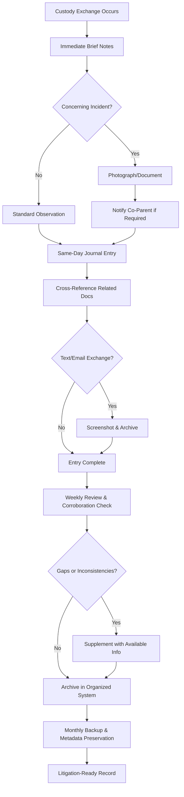

## Executive Summary

The contemporaneous record doctrine—the evidentiary principle that records created at or near the time of events they document carry enhanced reliability and admissibility—plays a critical role in family court proceedings where parties routinely present journals, calendars, text message logs, and other documentation to establish parenting time compliance, custodial interference, domestic incidents, or co-parent communication patterns. Unlike commercial litigation where business records predominate, family law cases frequently involve personal records lacking traditional indicia of reliability such as organizational recordkeeping systems or routine verification procedures. This creates authentication challenges under Federal Rule of Evidence 901(a) and hearsay obstacles that must be navigated through exceptions under FRE 803(1) (present sense impression), 803(3) (then-existing mental or emotional state), 803(6) (business records), or 807 (residual exception).

For [self-represented litigants](#) in custody disputes, understanding what constitutes a properly authenticated contemporaneous record—and how to create documentation systems during ongoing proceedings that courts will credit—is essential to establishing factual foundations for relief. Courts distinguish sharply between entries made contemporaneously with observed events (admissible if properly authenticated) and retrospective narratives created in anticipation of litigation (often excluded as unreliable and self-serving). The temporal proximity requirement, recordkeeping consistency, corroboration through [metadata as evidence](#), and ability to demonstrate systematic documentation practices determine whether personal records achieve evidentiary weight.

This analysis examines the doctrinal foundations of contemporaneous record admissibility in family court contexts, authentication requirements under state and federal rules, hearsay exceptions applicable to personal documentation, and practical implementation strategies for creating litigation-ready records. Whether documenting parenting time exchanges, preserving evidence of co-parent communications, or maintaining incident logs for protective order proceedings, understanding judicial expectations for contemporaneous records enhances evidentiary credibility and litigation outcomes. The emergence of digital tools that automatically timestamp entries and preserve metadata creates new opportunities—and new authentication requirements—for family court evidence presentation.

## Core Doctrinal Framework

### Definition: Contemporaneous Record

> **Contemporaneous Record**: A written, electronic, or other documented account of events, observations, or communications created at or near the time of the matter recorded, before memory fades or litigation motivation arises. In family court contexts, contemporaneous records include: (1) daily parenting journals documenting custody exchanges, visitation compliance, and child welfare observations; (2) calendars recording scheduled and actual parenting time; (3) incident logs memorializing concerning behaviors or safety issues; (4) communication logs tracking co-parent contacts; and (5) financial records documenting child support or expense-sharing. The temporal proximity and systematic nature of recordkeeping enhance reliability and support admissibility under various hearsay exceptions. *United States v. Vigneau*, 187 F.3d 70, 74-75 (1st Cir. 1999).

The doctrine rests on two reliability rationales: (1) temporal proximity reduces memory degradation and reconstruction errors; and (2) routine recordkeeping practices before litigation arises reduce incentives for fabrication or distortion. Courts scrutinize claimed contemporaneous records for indicia of reliability including consistent formatting, logical chronology, absence of gaps or alterations, and corroboration through external evidence.

### Temporal Proximity Requirement

"Contemporaneous" does not demand instantaneous recording—courts recognize practical constraints on documentation. The critical inquiry is whether the interval between event and recording was sufficiently brief that memory remained fresh and undistorted. Case law establishes flexible standards:

- **Same-day recording**: Generally satisfies contemporaneousness for routine observations and events. *Griffin v. State*, 419 Md. 343, 364, 19 A.3d 415, 428 (2011) (diary entries made same day as events constituted contemporaneous records).

- **Next-day recording**: Typically acceptable for detailed or complex events requiring time to document fully, particularly if established as systematic practice. *In re Marriage of Hansen*, 733 N.W.2d 683, 700 (Iowa 2007) (parenting journal updated nightly qualified as contemporaneous).

- **Weekly summaries**: May satisfy contemporaneousness if supported by underlying daily notes, calendar entries, or other memory aids created closer in time. Standing alone, weekly summaries face heightened scrutiny for reconstruction concerns.

- **Retroactive creation**: Narratives created weeks, months, or years after events—particularly after litigation commences—generally fail contemporaneousness requirements and face exclusion as unreliable and self-serving. *Palmer v. Hoffman*, 318 U.S. 109, 113-14 (1943).

### Systematic Practice vs. Sporadic Documentation

Courts distinguish between systematic recordkeeping and sporadic documentation created only for advantageous events. A parenting journal with daily entries spanning months or years demonstrates systematic practice; isolated entries coinciding only with alleged violations suggests selective memorialization and reduced credibility.[^1]

Evidentiary weight increases when records exhibit:
- **Consistent format and structure** across entries
- **Regular cadence** (daily, weekly) regardless of event significance
- **Inclusion of neutral or unfavorable information** (not purely self-serving)
- **Contemporaneous corroboration** through dated photographs, timestamped texts, or third-party observations
- **Pre-litigation origin** established through dates, witness testimony, or [metadata preservation](#)

## Governing Law

### Federal Rules of Evidence

**Rule 803(1): Present Sense Impression**

"A statement describing or explaining an event or condition, made while or immediately after the declarant perceived it."[^2] This exception permits admission of out-of-court statements (written or oral) describing events as they occur or immediately thereafter, based on reliability derived from minimal opportunity for reflection or fabrication.

Application to family court: Text messages sent during custody exchanges ("He arrived 45 minutes late, children not properly dressed") may qualify as present sense impressions. Journal entries made hours after the fact typically exceed "immediately after" temporal requirements, though courts apply flexible standards in parenting contexts.[^3]

**Rule 803(3): Then-Existing Mental, Emotional, or Physical Condition**

Permits statements of declarant's then-existing state of mind, emotion, sensation, or physical condition, but not statements of memory or belief to prove the fact remembered. Courts admit parenting journal entries documenting emotional states ("I felt fearful when he raised his voice") but exclude entries asserting past facts ("He has always been violent").[^4]

**Rule 803(6): Business Records Exception**

Requires: (1) record made at or near the time by someone with knowledge; (2) kept in the course of regularly conducted activity; (3) making the record was regular practice of the activity; (4) shown by testimony of custodian or qualified witness or by certification; and (5) opponent does not show untrustworthiness.[^5]

Personal parenting journals rarely qualify as "business records" because they lack organizational structure and independent verification. However, records maintained through systematic personal practice may satisfy the exception if the keeper testifies to regular methodology.[^6] Digital platforms with automatic timestamping and metadata generation strengthen business records arguments.

**Rule 803(8): Public Records Exception**

Applicable to police reports, CPS investigations, and official custody evaluations in family court proceedings. *Beech Aircraft Corp. v. Rainey*, 488 U.S. 153 (1988).

**Rule 807: Residual Exception**

Permits admission of hearsay not covered by specific exceptions if: (1) statement has equivalent circumstantial guarantees of trustworthiness; (2) offered to prove material fact; (3) more probative than other available evidence; (4) admission serves interests of justice; and (5) notice provided to adverse party.[^7]

Contemporaneous parenting journals may qualify under Rule 807 when detailed, systematic, corroborated, and created without litigation motive. *Idaho v. Wright*, 497 U.S. 805, 820-21 (1990) (circumstantial guarantees of trustworthiness required).

### State Variations

**Uniform Business Records as Evidence Act (Adopted in Majority of States)**

State versions of the business records exception generally track FRE 803(6) but may include variations:

- **California Evidence Code § 1271**: Requires that records were "made in the regular course of business at or near the time of the act, condition, or event." California courts have held that personal journals may qualify if keeper testifies to systematic practice.[^8]

- **New York CPLR § 4518**: Business records admissible if made "in the regular course of any business" and "it was the regular course of such business to make" such records. New York Family Court Act § 165 authorizes relaxed evidentiary standards in custody proceedings, increasing contemporaneous record admissibility.[^9]

- **Texas Rule of Evidence 803(6)**: Mirrors federal rule. Texas family courts emphasize reliability factors including regularity, detail, and corroboration. *In re J.P.B.*, 180 S.W.3d 570, 575 (Tex. 2005).

- **Florida Evidence Code § 90.803(6)**: Substantially identical to federal rule. Florida courts scrutinize personal journals for self-serving content and litigation timing. *Yisrael v. State*, 993 So. 2d 952, 956 (Fla. 2008).

- **Illinois Compiled Statutes 735 ILCS 5/8-1201**: Business records exception permits admission if "made in the regular course of business" and authenticated by custodian. Illinois family courts apply flexible standards recognizing resource constraints on pro se litigants.[^10]

### Authentication Requirements

Before addressing hearsay, contemporaneous records must satisfy FRE 901(a) authentication: "The proponent must produce evidence sufficient to support a finding that the item is what the proponent claims it is."[^11]

Authentication of personal journals typically requires:
1. **Testimony of the author** identifying the record as their creation
2. **Description of recordkeeping methodology** (when, how, why entries made)
3. **Demonstration of temporal proximity** to recorded events
4. **Explanation of physical characteristics** (bound notebook, digital timestamps, etc.)
5. **Corroboration through extrinsic evidence** where available (texts, emails, photos)

For digital records, authentication requires additional showing of:
- **Device security** (password protection, limited access)
- **Timestamp reliability** (system-generated vs. user-entered dates)
- **[Metadata preservation](#)** establishing creation/modification dates
- **Hash verification** if chain of custody challenged
- **Freedom from alteration** through version control or audit trails

*Lorraine v. Markel Am. Ins. Co.*, 241 F.R.D. 534, 546-47 (D. Md. 2007) (establishing authentication framework for electronic records).

## Hearsay Analysis in Family Court Contexts

### Personal Parenting Journals

**Typical Content**: Daily logs of custody exchanges, parenting time compliance, child behavior observations, communication with co-parent, incidents of concern.

**Authentication**: Author testimony describing creation methodology and temporal proximity.

**Hearsay Challenges**: Journals contain out-of-court statements offered for truth of assertions—classic hearsay requiring exception for admission.

**Applicable Exceptions**:
- **803(1) Present Sense Impression**: Entries made during or immediately after events ("4:30pm - Drop-off, 20 min late, no car seat")
- **803(3) Then-Existing Condition**: Emotional state entries ("Felt anxious about his anger")
- **803(6) Business Records**: If systematic practice demonstrated through testimony
- **807 Residual**: If detailed, corroborated, systematic, and trustworthy

**Exclusion Risks**: Retrospective narratives, legal conclusions ("He violated the parenting plan"), opinions without foundation, inflammatory characterizations.

**Best Practices**:
- **Objective observations** rather than subjective conclusions
- **Specific facts**: times, dates, locations, quoted statements
- **Neutral tone** avoiding inflammatory language
- **Consistent format** demonstrating systematic practice
- **Contemporaneous corroboration** (photos, texts, witnesses)

### Text Message Logs and Email Archives

**Typical Content**: Communications with co-parent regarding scheduling, child welfare, disputes; communications with third parties (schools, doctors) regarding children.

**Authentication**: Testimony identifying participants, circumstances, and context; [metadata as evidence](#) establishing timestamps and origination; device forensics if contested.

**Hearsay Challenges**: Text/email content contains out-of-court statements. Messages from opposing party may be admissions under FRE 801(d)(2). Messages from declarant require exception.

**Applicable Exceptions**:
- **801(d)(2) Opposing Party Statement**: Co-parent's texts/emails admissible as admissions
- **803(1) Present Sense Impression**: Messages sent during events
- **803(3) Then-Existing Condition**: Messages describing emotional states
- **Non-hearsay use**: To show notice, knowledge, or effect on recipient

**Authentication Standards**: *Griffin v. State*, 419 Md. 343, 19 A.3d 415 (2011) (text messages authenticated through context, content, and reply patterns); *United States v. Browne*, 834 F.3d 403, 410 (3d Cir. 2016) (metadata and circumstantial evidence sufficient).

### Calendars and Scheduling Records

**Typical Content**: Notation of scheduled parenting time, actual exchanges, deviations from court orders.

**Authentication**: Testimony describing recordkeeping practice; demonstration that entries were made contemporaneously, not retroactively.

**Hearsay Analysis**: Calendar entries asserting past facts ("Mom failed to return children") constitute hearsay. Entries documenting author's scheduled activities may be non-hearsay if offered to show declarant's intent or plan under FRE 803(3).

**Admissibility Enhancement**: Corroboration through third-party calendars (school records showing absence on disputed days), digital calendar metadata showing entry creation dates, text messages confirming or disputing scheduled times.

### Incident Reports and Safety Logs

**Typical Content**: Documentation of concerning behaviors, substance abuse observations, safety violations, domestic incidents.

**Authentication**: Author testimony; police reports, medical records, or CPS investigations corroborating entries.

**Hearsay Challenges**: Heightened scrutiny for self-serving allegations in custody disputes.

**Applicable Exceptions**:
- **803(1) Present Sense Impression**: If documented during/immediately after incident
- **803(2) Excited Utterance**: Statements made under stress of startling event
- **807 Residual**: If detailed, specific, and corroborated by external evidence

**Credibility Factors**: Consistency with contemporaneous actions (police call, protective order filing, medical treatment); inclusion of neutral or unfavorable observations; detailed rather than conclusory; free from inflammatory embellishment.

### Financial Records and Expense Tracking

**Typical Content**: Documentation of child-related expenditures for support modification or reimbursement claims.

**Authentication**: Author testimony; receipts, bank statements, credit card records.

**Hearsay Analysis**: Financial records typically qualify under FRE 803(6) if maintained systematically. Receipts are non-hearsay if offered to prove expenditure occurred (not for truth of merchant's assertions on receipt).

**Best Practices**: Contemporaneous logging of expenses in spreadsheet or app; preservation of receipts with dates/amounts; categorical organization (medical, education, extracurricular); separation of reimbursable vs. basic support costs.

## Practical Implementation Standards

### Creating Litigation-Ready Contemporaneous Records

**Format Selection**:
- **Bound notebooks**: Physically demonstrate chronological integrity and prevent page insertion/removal
- **Digital platforms with audit trails**: Timestamp entries, track modifications, generate metadata
- **Hybrid approach**: Daily notes in bound notebook, weekly transcription to digital platform with scans of original

**Content Guidelines**:
```markdown
EFFECTIVE ENTRY STRUCTURE:

Date: [MM/DD/YYYY]
Time: [HH:MM AM/PM]
Event: [Custody exchange / Communication / Incident / Other]

Objective Facts:
- Location: [Specific address]
- Participants: [Names of individuals present]
- Actions observed: [Factual description without conclusions]
- Statements made: [Direct quotations where possible]
- Duration: [Start/end times]

Context:
- Weather/environmental conditions: [If relevant]
- Child demeanor: [Observable behaviors, not diagnoses]
- Prior communications: [Reference to texts/emails]

Contemporaneous corroboration:
- Photos taken: [File names, timestamps]
- Witnesses present: [Names, contact information]
- Related documents: [Text messages, emails - reference by date/time]

Follow-up actions:
- Notifications sent: [To whom, by what method, time]
- Authorities contacted: [Police, CPS - report numbers]
- Documentation created: [Photos, recordings, copies provided]

Recorded by: [Signature]
Time of documentation: [If different from event time]
```

**Temporal Discipline**:
- **Same-day recording**: Establish habit of documenting significant events within hours
- **Standing entry times**: Designate regular times (e.g., 9pm nightly) for journaling
- **Immediate notes**: Jot brief notes during events, expand same day
- **Timestamp everything**: Note both event time and documentation time

**Corroboration Integration**:
- **Photograph coordination**: Take timestamped photos at exchanges, reference in journal
- **Text preservation**: Screenshot texts immediately, reference in journal by timestamp
- **Third-party confirmation**: Note witnesses, obtain contact information, follow up for statements
- **[Metadata preservation](#)**: Maintain digital files in original format with metadata intact

### Recordkeeping Workflow for Custody Proceedings



### Authentication Preparation Checklist

```markdown
PRE-TRIAL CONTEMPORANEOUS RECORD AUTHENTICATION

□ **Author Preparation**
  □ Review entire journal/record for accuracy
  □ Prepare to testify to creation methodology
  □ Identify any gaps or irregularities with explanations
  □ Refresh recollection using entries before testimony
  
□ **Physical/Digital Integrity**
  □ Verify no missing pages or altered entries
  □ Generate metadata report for digital records
  □ Create hash values for digital files
  □ Prepare chain of custody if multiple locations
  
□ **Corroboration Assembly**
  □ Compile photos referenced in entries
  □ Organize text/email screenshots by date
  □ Prepare witness list for third-party corroboration
  □ Obtain relevant public records (police, CPS, medical)
  
□ **Hearsay Exception Preparation**
  □ Identify applicable exception for each entry type
  □ Prepare testimony establishing temporal proximity
  □ Document systematic recordkeeping practice
  □ Compile evidence of trustworthiness (regularity, corroboration, detail)
  
□ **Exhibit Preparation**
  □ Create master chronological index
  □ Organize entries by category/theme
  □ Prepare excerpts for key incidents
  □ Number pages and create table of contents
  
□ **Objection Anticipation**
  □ Identify potentially problematic entries (conclusory, inflammatory)
  □ Prepare foundation for technical/specialized observations
  □ Have explanations for any retrospective entries
  □ Prepare response to "created for litigation" arguments
```

### Digital Platform Standards

Modern evidence organization platforms offer advantages over traditional paper journals:

**Automatic Timestamping**: System-generated timestamps create non-repudiable temporal records, defeating claims of retroactive creation.[^12]

**Metadata Generation**: Creation date, modification history, device information, and GPS coordinates (if enabled) provide authentication support exceeding testimony alone.

**Cloud Backup**: Distributed storage with version control demonstrates record existed before litigation events, countering fabrication arguments.

**Access Logging**: Audit trails showing no modifications after specific dates establish record integrity.

**Export Flexibility**: Generation of authenticated PDFs with embedded metadata facilitates court filing and opposing counsel production.

**Integration Capabilities**: Linking journal entries to timestamped photos, text screenshots, and email archives creates comprehensive evidentiary packages.

## Emerging Issues

### Retroactive Alteration Detection

As parties increasingly present digital records, courts confront questions of post-creation modification. While traditional paper journals show physical evidence of erasures or insertions, digital files can be seamlessly altered unless protected by audit trails or hash verification.

Defense counsel increasingly retain forensic experts to examine [metadata as evidence](#) of creation and modification dates, revealing entries allegedly made contemporaneously that were actually created or modified during litigation. Courts are developing heightened scrutiny for digital records lacking independent authentication through cloud service timestamps or third-party verification.[^13]

### Privacy vs. Preservation Tensions

Family court litigants face tension between protecting children's privacy and creating evidentiary records. Detailed journals documenting child statements, emotional states, or behaviors may be necessary to establish best interests but raise concerns about child dignity and future disclosure risks.

Courts are developing *in camera* review procedures for sensitive contemporaneous records, allowing judicial consideration while limiting public access. Some jurisdictions permit redacted versions for general filing with complete versions under seal.[^14]

### Social Media as Contemporaneous Record

Facebook posts, Instagram stories, and other social media content timestamped to relevant events constitute contemporary documentation of activities, locations, and statements. Courts admit such evidence but scrutinize audience and purpose—public posts to friends differ from litigation-motivated documentation.

Authentication requires testimony regarding account ownership, posting practices, and privacy settings, plus metadata establishing post dates. Screenshots alone may be insufficient without corroboration through platform-generated archives or subpoenaed records.[^15]

### Automated Recording Challenges

Voice-activated assistants, smart home devices, and automated activity tracking create contemporaneous records without intentional documentation. Courts have admitted Ring doorbell footage, Alexa recordings, and fitness tracker GPS data in custody cases, but authentication and privacy issues remain evolving.

The spontaneous nature of such records enhances reliability arguments, but admissibility requires showing: (1) device operated properly; (2) recording is complete and unaltered; (3) privacy expectations were reasonable; and (4) recording complies with state wiretapping laws.[^16]

### Burden of Production for Opposing Party Records

When one party maintains detailed contemporaneous records and the other does not, courts must determine whether negative inferences are appropriate. Some jurisdictions hold that failure to maintain records demonstrates lack of concern; others recognize that recordkeeping capacity varies with education, resources, and personality.

The better approach considers recordkeeping asymmetry as one credibility factor among many, not dispositive absent corroborating evidence.[^17]

## Practical Implementation Tools

ThreadLock's Family Court Evidence Suite addresses contemporaneous record challenges through integrated journaling, metadata preservation, and corroboration linking. The Parenting Time Log module provides structured templates for custody exchanges, incident documentation, and communication tracking, with automatic timestamping that defeats retroactive creation challenges.

The platform's Authentication Assistant guides [self-represented litigants](#) through foundational testimony preparation, generating customized scripts addressing temporal proximity, systematic practice, and corroboration. Integration with photo galleries and text message imports creates comprehensive evidentiary packages with cross-referenced metadata.

ThreadLock's Hearsay Exception Analyzer evaluates journal entries against applicable exceptions, flagging potentially inadmissible content (legal conclusions, inflammatory characterizations, excessive speculation) before filing. The tool suggests revision strategies that preserve evidentiary value while enhancing admissibility.

For custody modification proceedings, the Timeline Generator compiles journal entries, text messages, and public records into chronological narratives with visual representations, transforming scattered documentation into coherent presentations. Export functions generate court-ready exhibits with automatic page numbering, indices, and authentication declarations.

## How to Cite This Page

### Bluebook (21st ed.)
ThreadLock Legal Research Division, *Contemporaneous Record Doctrine in Family Court Proceedings*, THREADLOCK (Feb. 27, 2026), https://threadlock.app/authority/contemporaneous-record-doctrine-family-court.

### APA (7th ed.)
ThreadLock Legal Research Division. (2026, February 27). *Contemporaneous record doctrine in family court proceedings*. ThreadLock. https://threadlock.app/authority/contemporaneous-record-doctrine-family-court

### MLA (9th ed.)
ThreadLock Legal Research Division. "Contemporaneous Record Doctrine in Family Court Proceedings." *ThreadLock*, 27 Feb. 2026, threadlock.app/authority/contemporaneous-record-doctrine-family-court.

### Legal Memorandum
See ThreadLock Legal Research Division, Contemporaneous Record Doctrine in Family Court Proceedings (Feb. 27, 2026), available at https://threadlock.app/authority/contemporaneous-record-doctrine-family-court (analyzing authentication requirements, hearsay exceptions, and best practices for personal recordkeeping in custody litigation).

## References

[^1]: *In re Marriage of Hansen*, 733 N.W.2d 683, 699-700 (Iowa 2007) (systematic parenting journal spanning 18 months admitted; sporadic entries excluded).

[^2]: Fed. R. Evid. 803(1).

[^3]: *United States v. Vigneau*, 187 F.3d 70, 74-75 (1st Cir. 1999) (discussing temporal limits of "immediately after").

[^4]: Fed. R. Evid. 803(3); *Mutual Life Ins. Co. v. Hillmon*, 145 U.S. 285, 295-96 (1892).

[^5]: Fed. R. Evid. 803(6).

[^6]: *Palmer v. Hoffman*, 318 U.S. 109, 113-14 (1943) (business records must be routine, not prepared for litigation).

[^7]: Fed. R. Evid. 807.

[^8]: Cal. Evid. Code § 1271; *People v. Zavala*, 220 Cal. App. 4th 24, 30 (2013).

[^9]: N.Y. CPLR § 4518; N.Y. Fam. Ct. Act § 165.

[^10]: 735 ILCS 5/8-1201; *In re Marriage of Betts*, 200 Ill. App. 3d 26, 33 (1990).

[^11]: Fed. R. Evid. 901(a).

[^12]: *Lorraine v. Markel Am. Ins. Co.*, 241 F.R.D. 534, 546 (D. Md. 2007).

[^13]: *United States v. Browne*, 834 F.3d 403, 410-11 (3d Cir. 2016) (metadata analysis revealed backdating).

[^14]: *See, e.g.*, Cal. Fam. Code § 3027.1 (authorizing sealed filings in custody cases).

[^15]: *Griffin v. State*, 419 Md. 343, 362-65, 19 A.3d 415, 427-29 (2011) (social media authentication standards).

[^16]: *State v. Bock*, 229 A.3d 821, 826-28 (Conn. 2020) (smart home device recordings admissible with proper foundation).

[^17]: *In re Marriage of Burgess*, 913 P.2d 473, 481 (Cal. 1996) (recordkeeping asymmetry considered with other factors).

---

<script type="application/ld+json">
{
  "@context": "https://schema.org",
  "@type": "LegalArticle",
  "headline": "Contemporaneous Record Doctrine in Family Court Proceedings",
  "description": "Comprehensive analysis of the contemporaneous record rule in family law contexts, including authentication requirements for journals, calendars, text messages, and digital communications presented as business or personal records.",
  "author": {
    "@type": "Organization",
    "name": "ThreadLock Legal Research Division"
  },
  "datePublished": "2026-02-27",
  "dateModified": "2026-02-27",
  "publisher": {
    "@type": "Organization",
    "name": "ThreadLock",
    "url": "https://threadlock.app"
  },
  "about": [
    {
      "@type": "LegalCode",
      "name": "Federal Rule of Evidence 803(1)",
      "legislationIdentifier": "Fed. R. Evid. 803(1)"
    },
    {
      "@type": "LegalCode",
      "name": "Federal Rule of Evidence 803(6)",
      "legislationIdentifier": "Fed. R. Evid. 803(6)"
    }
  ],
  "spatialCoverage": {
    "@type": "Country",
    "name": "United States"
  },
  "keywords": "contemporaneous records, family court, business records exception, present sense impression, hearsay exceptions, custody evidence, parenting time documentation, journal admissibility",
  "educationalLevel": "Professional",
  "isAccessibleForFree": true
}
</script>
