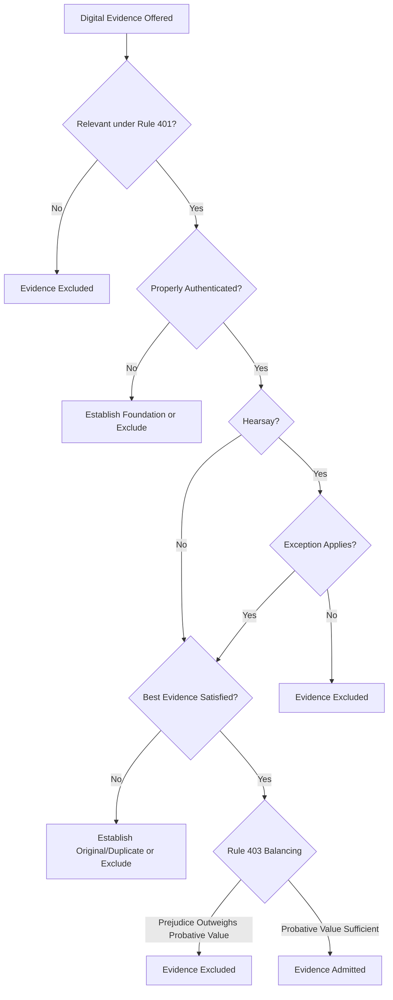

# Digital Exhibit Admissibility Standards in Family Court

## Executive Summary

Digital exhibits have become the predominant form of evidence in family court proceedings. Text messages documenting co-parenting disputes, emails regarding child support, social media posts evidencing lifestyle choices, and financial records stored electronically constitute the evidentiary foundation for custody, support, and property division matters. However, digital evidence presents distinct admissibility challenges beyond those encountered with traditional paper documents.

Admissibility analysis requires sequential examination of multiple evidentiary requirements: relevance under Federal Rule 401, authentication under Rule 901, hearsay analysis under Rules 801-807, and best evidence rule compliance under Rules 1001-1008.[^1] Digital evidence often triggers all four inquiries simultaneously. A text message, for example, must be relevant to a disputed issue, authenticated as genuine, analyzed for hearsay exceptions, and presented in a form satisfying original document requirements.

This article provides a comprehensive framework for digital exhibit admissibility in family court proceedings, examining federal and state standards, jurisdictional variations, and practical guidance for establishing proper foundation. The analysis demonstrates that while digital evidence is routinely admitted in family courts nationwide, admissibility requires careful attention to technical requirements that many self-represented litigants and even experienced counsel overlook.

## Core Doctrinal Framework

### Definition: Admissibility

**Legal Standard:**  
Evidence is admissible if it is relevant, authenticated, not subject to an exclusionary rule (such as hearsay without exception), and presented in a form satisfying best evidence requirements. The proponent bears the burden of establishing each foundation element.[^2]

**Explanation:**  
Admissibility operates as a gatekeeper function, determining what evidence the trier of fact may consider. The standard for admission is not "proof beyond reasonable doubt" but rather a prima facie showing sufficient to support a finding of the foundational fact. Once admitted, the trier of fact determines weight and credibility.

**Application in Family Court:**  
Family courts generally apply evidentiary rules with practical flexibility, particularly where child welfare issues predominate. Courts recognize that rigid application of technical rules may exclude probative evidence central to best interests determinations. However, this flexibility has limits—evidence lacking fundamental indicia of reliability, authenticity, or relevance will be excluded regardless of potential probative value.

### Relevance: Federal Rule 401

Evidence is relevant if it has any tendency to make a fact more or less probable than it would be without the evidence, and the fact is of consequence in determining the action.[^3] This is a low threshold—evidence need not conclusively prove a proposition, merely make it marginally more or less likely.

In family court contexts, relevance analysis often centers on best interests factors:
- Parental fitness and caregiving capacity
- Child safety and welfare
- Financial resources and ability to provide support
- Compliance with court orders
- Communication and cooperation between parents

Digital evidence frequently addresses these issues directly. Text messages may evidence communication patterns, emails may document financial circumstances, and social media posts may reveal lifestyle choices affecting parental fitness. However, probative value must be balanced against prejudicial effect under Rule 403.

### Authentication: The Threshold Requirement

As detailed in [Evidence Authentication in Family Court](#), authentication requires evidence sufficient to support a finding that the digital exhibit is what the proponent claims it to be.[^4] For digital evidence, authentication typically requires:

1. **Testimony regarding evidence origin** - How was the digital evidence obtained and preserved?
2. **Distinctive characteristics** - Does the content include markers suggesting the claimed source?
3. **Process or system evidence** - Was the evidence generated by a reliable process?
4. **Metadata corroboration** - Do technical markers support claimed authenticity?

### Hearsay Analysis: Rules 801-807

Hearsay is a statement that the declarant does not make while testifying at the current trial or hearing and that a party offers to prove the truth of the matter asserted.[^5] Digital communications—text messages, emails, social media posts—are statements offered to prove their content, thus constituting hearsay.

**Key hearsay exceptions applicable to digital evidence in family court:**

**Present Sense Impression (Rule 803(1)):**  
A statement describing or explaining an event or condition, made while or immediately after the declarant perceived it. Digital time-stamping may support present sense impression foundation if the communication occurred contemporaneously with the described event.

**Excited Utterance (Rule 803(2)):**  
A statement relating to a startling event, made while under stress from the event. Digital communications sent immediately following a traumatic incident may qualify if circumstances demonstrate emotional stress.

**Then-Existing Mental, Emotional, or Physical Condition (Rule 803(3)):**  
A statement of the declarant's then-existing state of mind, emotion, sensation, or physical condition. Particularly relevant in custody disputes where a parent's or child's emotional state is at issue.

**Statement Against Interest (Rule 804(b)(3)):**  
A statement that a reasonable person in the declarant's position would not have made unless believing it true because it was so contrary to the declarant's interest. Often applicable to financial admissions in support proceedings.

**Admissions by Party-Opponent (Rule 801(d)(2)):**  
Statements made by an opposing party are not hearsay when offered against that party. This is the most common basis for admitting text messages, emails, and social media posts from the opposing party in family court.

### Best Evidence Rule: Rules 1001-1008

The best evidence rule requires production of an original document or reliable duplicate to prove the document's content.[^6] However, the rule's application to digital evidence has evolved substantially:

**Rule 1001(d) - Defining "Original":**  
For electronically stored information, an "original" means any printout or other output readable by sight if it accurately reflects the information. This effectively permits screenshots and printouts of digital evidence as "originals" if accurately representing the underlying data.

**Rule 1003 - Admissibility of Duplicates:**  
A duplicate is admissible to the same extent as the original unless a genuine question exists about the original's authenticity or circumstances make it unfair to admit the duplicate. Digital evidence rarely encounters best evidence objections because screenshots and printouts constitute acceptable duplicates under modern interpretation.

**Rule 1004 - Admissibility of Other Evidence:**  
Even where an original is required but unavailable, other evidence of content may be admitted if:
- All originals are lost or destroyed (unless the proponent destroyed them in bad faith)
- The original cannot be obtained by judicial process
- The original is in the opponent's possession and was not produced despite reasonable notice
- The evidence relates to a collateral matter

## Governing Law and Precedent

### Federal Standards

**Aguilar v. ICE** addressed admissibility of social media evidence in immigration proceedings, but the court's analysis applies broadly to digital evidence authentication.[^7] The court held that social media posts, like other digital evidence, may be authenticated through circumstantial evidence including account information, distinctive content, and corroborating testimony.

**United States v. Zhyltsou** remains the leading case on digital evidence admissibility, establishing that authentication and hearsay are separate inquiries.[^8] A text message may be authenticated (establishing it came from the claimed source) yet still excluded as hearsay if no exception applies. Conversely, a communication may qualify for a hearsay exception yet still require authentication proving its source.

The **Lorraine v. Markel** framework for electronic evidence applies with full force in family court.[^9] The court emphasized that electronic evidence authentication and admissibility require the same foundation as traditional documents, but the methods of establishing foundation may differ based on the evidence's digital nature.

### State Family Court Standards

**California:**  
California Evidence Code §§ 1400-1401 govern authentication of writings, which California courts interpret to include digital communications.[^10] California family courts apply a totality-of-circumstances approach, considering context, content, and corroborating evidence. California Rule of Court 5.113 permits courts to admit evidence in a manner serving the child's best interests, potentially relaxing technical requirements where evidence is clearly probative and reliability is not genuinely disputed.

**New York:**  
New York CPLR 4518 provides that business records and official records may be admitted with proper certification.[^11] For digital evidence not qualifying as business records, New York courts require traditional authentication foundation. The New York Court of Appeals has held that social media evidence requires substantial foundation, including testimony regarding account ownership and access controls.

**Texas:**  
Texas applies authentication and admissibility requirements rigorously even in family court proceedings. Texas Rule of Evidence 901 mirrors federal standards, and Texas courts expect detailed foundation testimony regarding digital evidence origin and preservation.[^12] Texas courts have been particularly skeptical of screenshots without supporting metadata or testimony regarding preservation methods.

**Florida:**  
Florida Evidence Code §§ 90.401, 90.901-902 govern admissibility and authentication.[^13] Florida family courts generally permit digital evidence with appropriate foundation but require authentication testimony addressing evidence reliability. Florida courts have held that text message authentication requires testimony that the message came from the claimed source, which may be established through content, context, and response patterns.

**Illinois:**  
Illinois Rules of Evidence 401, 801-807, and 901 apply in family court proceedings.[^14] Illinois courts permit authentication through distinctive characteristics and circumstantial evidence but expect some corroboration. Illinois courts have admitted social media evidence authenticated through account information, distinctive content, and testimony from individuals familiar with the account.

## Jurisdictional Comparison: Digital Evidence Standards

| Jurisdiction | Authentication Standard | Hearsay Analysis | Best Evidence Application | Self-Rep Flexibility |
|--------------|------------------------|------------------|--------------------------|---------------------|
| **Federal** | FRE 901; circumstantial evidence permitted | Strict hearsay analysis; exceptions well-developed | Modern interpretation permits printouts as originals | Limited flexibility; expect proper foundation |
| **California** | Totality of circumstances; relaxed for best interests | Liberal exception application in custody matters | Screenshots/printouts routinely admitted | Significant flexibility; courts assist pro se parties |
| **New York** | Substantial foundation required | Traditional hearsay analysis | Permits duplicates with proper foundation | Moderate flexibility; some guidance provided |
| **Texas** | Strict authentication requirements | Rigorous hearsay analysis | Expects original or certified duplicate | Limited flexibility; technical compliance expected |
| **Florida** | Moderate authentication standards | Hearsay exceptions apply liberally in family court | Printouts acceptable with authentication | Moderate flexibility for self-represented litigants |
| **Illinois** | Circumstantial evidence permitted | Traditional hearsay framework | Duplicates admitted if reliable | Courts provide guidance but expect compliance |

### Text Message Admissibility: State Approaches

**California** permits text message admission through relatively minimal foundation where the content and context support authenticity. Courts recognize that strict authentication requirements may exclude critical evidence in domestic violence and custody matters. However, California courts have excluded text messages where foundation was entirely absent or authenticity was seriously contested.

**New York** requires testimony regarding phone number ownership, prior text message exchanges, and distinctive content or communication patterns. New York courts have excluded text messages presented solely through screenshots without supporting testimony or metadata.

**Texas** expects detailed testimony regarding: (1) how the text messages were obtained; (2) the phone number from which they were sent; (3) the relationship between the sender and recipient; and (4) any distinctive characteristics supporting authenticity. Texas courts routinely exclude text messages lacking adequate foundation.

**Florida** permits text message authentication through testimony that: (1) the witness recognizes the sender's phone number; (2) the content is consistent with the claimed sender; (3) the witness has received prior communications from that number; and (4) reply messages indicate the sender's identity.

**Illinois** has held that text messages may be authenticated through circumstantial evidence including phone number records, distinctive content, and communication patterns. However, Illinois courts expect some foundation testimony beyond mere introduction of screenshots.

### Social Media Evidence: Jurisdictional Variations

Social media evidence presents heightened authentication challenges due to account compromise, impersonation, and privacy settings. State approaches vary:

**California** permits social media authentication through testimony that the witness is familiar with the account, the content is consistent with the account holder's known positions or activities, and the account information (username, profile photo, friends list) corresponds to the account holder. California courts recognize that social media accounts may be compromised but do not require absolute proof of authorship.

**New York** requires substantial foundation for social media evidence, including testimony regarding account creation, access controls, posting history, and distinctive characteristics. New York courts have excluded social media evidence where the proponent could not establish that the account holder actually created the contested posts.

**Texas** applies strict authentication requirements to social media evidence. Texas courts expect testimony addressing account security, the likelihood of third-party access, and circumstantial evidence linking specific posts to the account holder. Screenshots alone rarely suffice without corroborating testimony.

**Florida** permits social media authentication through testimony from someone familiar with the account, account information matching the purported holder, and content consistent with the account holder's known circumstances. Florida courts balance the probative value of social media evidence against authentication concerns.

**Illinois** requires authentication testimony addressing account ownership and post authorship but permits inference from context and content. Illinois courts have admitted social media evidence authenticated through account information and corroborating testimony from individuals familiar with the account holder's activities.

## Practice Toolkit

### Digital Evidence Admissibility Checklist

**Pre-Hearing Preparation:**
- [ ] Identify the digital evidence category (text, email, social media, financial records, etc.)
- [ ] Determine relevance to disputed issues in the case
- [ ] Establish authentication method and prepare foundation testimony
- [ ] Analyze potential hearsay issues and applicable exceptions
- [ ] Verify best evidence rule compliance
- [ ] Prepare for anticipated objections
- [ ] Organize exhibits with clear identification and numbering
- [ ] Create exhibit list with descriptions

**Foundation Requirements:**
- [ ] Witness who can authenticate the evidence
- [ ] Testimony regarding how evidence was obtained
- [ ] Evidence of distinctive characteristics or metadata
- [ ] Explanation of any gaps in chain of custody
- [ ] Corroborating evidence supporting authenticity
- [ ] Analysis of hearsay exceptions
- [ ] Demonstration that evidence is in admissible form

**Objection Preparation:**
- [ ] Anticipate relevance objections and prepare Rule 401 analysis
- [ ] Anticipate authentication objections and prepare Rule 901 foundation
- [ ] Anticipate hearsay objections and identify applicable exceptions
- [ ] Anticipate best evidence objections and confirm duplicate reliability
- [ ] Prepare responses to cumulative evidence arguments
- [ ] Prepare responses to Rule 403 prejudice arguments

### Foundation Questions for Digital Evidence

**Text Message Foundation:**

Q: Do you recognize Exhibit [X]?  
Q: What is Exhibit [X]?  
Q: How did you receive this text message?  
Q: What phone number did it come from?  
Q: How do you know this number belongs to [Party]?  
Q: Have you exchanged text messages with [Party] before?  
Q: Is the content consistent with [Party's] communication style?  
Q: How did you preserve this message?  
Q: Is Exhibit [X] a true and accurate copy of the message you received?  
Q: Have you altered this message in any way?

**Email Foundation:**

Q: Do you recognize Exhibit [X]?  
Q: From whom did you receive this email?  
Q: What email address sent this message?  
Q: How do you know this email address belongs to [Party]?  
Q: When did you receive this email?  
Q: How did you preserve this email?  
Q: Is this a complete copy of the email including all attachments?  
Q: Has anything been added or removed from this email?

**Social Media Evidence Foundation:**

Q: Do you recognize Exhibit [X]?  
Q: What is Exhibit [X]?  
Q: What social media platform is this from?  
Q: Whose account is shown in this exhibit?  
Q: How do you know this account belongs to [Party]?  
Q: Are you familiar with [Party's] social media activity?  
Q: How did you access this post?  
Q: When did you capture this screenshot?  
Q: Does Exhibit [X] accurately reflect the post as it appeared when you viewed it?  
Q: Is the username, profile photo, and account information consistent with [Party's] account?

### Objection and Response Framework

**Relevance Objection:**

**Objection:** "Irrelevant. This text message does not relate to any issue in dispute."

**Response:** "Your Honor, this evidence is relevant under Rule 401. The text message demonstrates [Party's] [communication pattern/financial circumstances/parenting decisions], which is directly relevant to the Court's best interests analysis regarding [custody/support/visitation]. The evidence makes [disputed fact] more or less probable."

**Authentication Objection:**

**Objection:** "Lack of foundation. This email has not been properly authenticated."

**Response:** "Your Honor, [Witness] testified that they received this email from [Party's] known email address, the content is consistent with prior communications from [Party], and the signature block matches [Party's] business information. This circumstantial evidence is sufficient under Rule 901(b)(4) to authenticate the email."

**Hearsay Objection:**

**Objection:** "Hearsay. This text message is an out-of-court statement offered for the truth of the matter asserted."

**Response:** "Your Honor, the text message is admissible under Rule 801(d)(2) as an admission by a party-opponent. [Party] sent this message, and it is being offered against [Party]. Alternatively, the message qualifies under Rule 803(3) as a statement of then-existing mental or emotional condition."

**Best Evidence Objection:**

**Objection:** "This screenshot violates the best evidence rule. The proponent must produce the original electronic file."

**Response:** "Your Honor, Rule 1001(d) defines 'original' for electronically stored information as any printout that accurately reflects the information. This screenshot is an original under the rule. Additionally, Rule 1003 permits duplicates unless there is a genuine question about authenticity, which [Party] has not raised."

### Admissibility Decision Tree

## Emerging Issues in Digital Evidence Admissibility

### Encrypted Communications and Privacy Concerns

End-to-end encrypted messaging platforms (WhatsApp, Signal, Telegram) present authentication and preservation challenges. Messages may be unavailable for independent verification, and platform providers typically cannot access encrypted content. Courts must balance privacy interests against evidentiary needs, particularly where communications involve protected health information or attorney-client communications.

Best practices include:
- Document the encryption method and platform policies
- Preserve messages in original format where possible
- Obtain consent for evidence preservation where feasible
- Consider privacy objections in Rule 403 balancing

### Cloud-Stored Evidence and Third-Party Control

Digital evidence stored on cloud platforms may be subject to terms of service permitting provider access, modification, or deletion. Authentication must address whether the proponent maintained continuous access to the evidence and whether third-party interference is possible.

Courts have held that evidence stored solely on cloud platforms without local preservation may be excluded where the proponent cannot demonstrate continuous custody or exclude third-party modification. For detailed analysis, see [Chain of Custody for Digital Files](#).

### Metadata Stripping and Alteration

Modern smartphones and social media platforms routinely strip metadata from shared images and videos. Screenshots remove technical markers that could verify authenticity. Courts must evaluate whether the absence of metadata renders evidence insufficiently reliable for admission.

Current judicial approaches suggest:
- Metadata absence does not automatically require exclusion
- Proponents should explain why metadata is unavailable
- Corroborating evidence becomes more important without metadata
- Intentional metadata stripping may support exclusion

For comprehensive analysis of metadata evidentiary value, see [Metadata as Evidence](#).

### AI-Generated Content Detection

The possibility that digital evidence may be AI-generated or AI-modified requires updated authentication analysis. Courts are beginning to require proponents to address whether evidence could have been generated by AI systems, particularly where content appears unusual or implausible.

Best practices emerging from early cases include:
- Conduct linguistic analysis for AI generation indicators
- Examine metadata for processing artifacts
- Consider whether content is consistent with known facts
- Permit expert testimony on AI detection where seriously contested

Related analysis available at [AI Hallucinations in Legal Filings](#) and [Judicial Treatment of AI-Assisted Drafting](#).

### Platform Terms of Service and Evidence Admissibility

Social media platform terms of service often prohibit unauthorized access to accounts or automated data collection. Evidence obtained in violation of terms of service may be subject to exclusion, though courts have been reluctant to exclude evidence based solely on terms of service violations absent additional wrongdoing.

The trend in family court cases suggests:
- Terms of service violations do not automatically require exclusion
- Courts consider the method of evidence acquisition in Rule 403 balancing
- Hacking, unauthorized access, or identity theft may result in exclusion
- Evidence obtained through authorized access is generally admissible

## Practical Implementation Tools

Centralized evidence management systems that organize digital exhibits by category, maintain original files with metadata intact, and generate authentication worksheets expedite admissibility foundation. Systems that create exhibit indexes, track chain of custody, and produce court-ready binders with proper foundation questions align with professional litigation standards. Such tools reduce hearing delays caused by authentication objections and ensure compliance with best evidence requirements while maintaining organized presentation expected in contemporary family court practice.

## How to Cite This Page

Moore, Hannah. "Digital Exhibit Admissibility Standards in Family Court." ThreadLock (2026).  
URL: https://threadlock.ai/authority/digital-exhibit-admissibility-standards  
Last updated: February 25, 2026.

## References

[^1]: Fed. R. Evid. 401, 801-807, 901, 1001-1008.

[^2]: Fed. R. Evid. 104(a), (b).

[^3]: Fed. R. Evid. 401.

[^4]: Fed. R. Evid. 901(a).

[^5]: Fed. R. Evid. 801(c).

[^6]: Fed. R. Evid. 1001-1008.

[^7]: Aguilar v. ICE, 510 F.3d 1 (1st Cir. 2007).

[^8]: United States v. Zhyltsou, 889 F.3d 1147 (11th Cir. 2018).

[^9]: Lorraine v. Markel Am. Ins. Co., 241 F.R.D. 534 (D. Md. 2007).

[^10]: Cal. Evid. Code §§ 1400-1401; Cal. R. Ct. 5.113.

[^11]: N.Y. C.P.L.R. 4518 (McKinney).

[^12]: Tex. R. Evid. 901; Tex. Fam. Code Ann. § 154.005.

[^13]: Fla. Stat. §§ 90.401, 90.901-902; Fla. Fam. Law R. 12.285.

[^14]: 735 ILCS 5/8-401 et seq.; Ill. R. Evid. 401, 801-807, 901.

