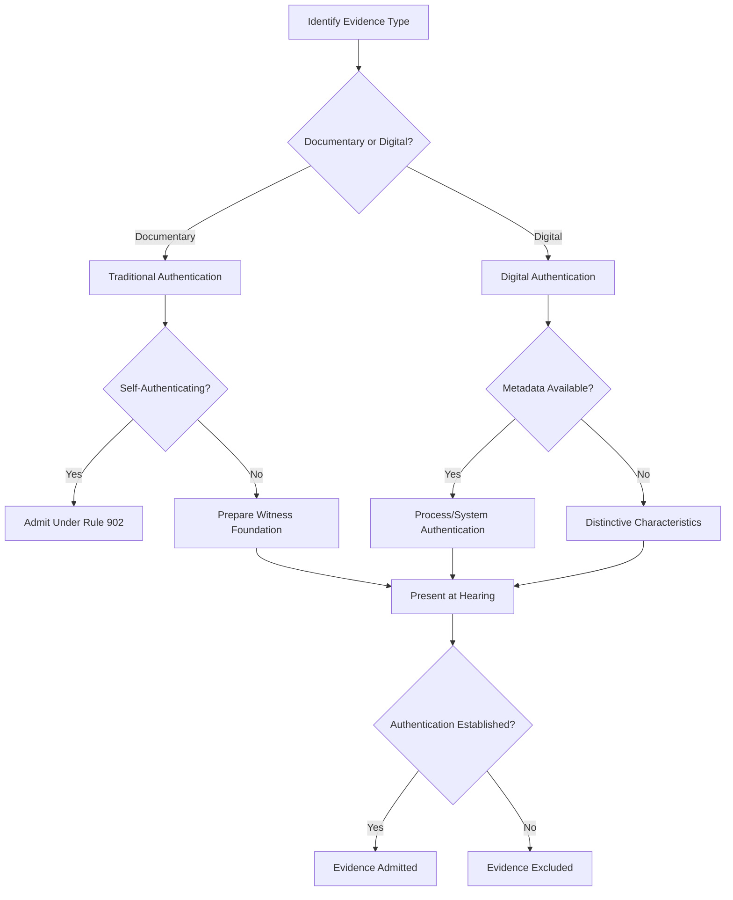

# Evidence Authentication in Family Court Proceedings

## Executive Summary

Authentication of evidence represents a threshold requirement for admissibility in family court proceedings across all jurisdictions. Federal Rule of Evidence 901 establishes the foundational standard: the proponent must produce evidence sufficient to support a finding that the item is what the proponent claims it to be.[^1] This requirement applies with equal force to traditional documentary evidence and emerging digital formats including text messages, emails, social media content, and multimedia files.

Family courts encounter authentication challenges distinct from general civil litigation. Self-represented litigants frequently struggle with technical foundation requirements. Digital communications between parties, which often constitute critical evidence in custody and support disputes, require authentication methodologies that many courts have only recently begun to address systematically. The proliferation of AI-generated content and deepfake technology has further complicated authentication analysis.

This article examines the doctrinal framework governing evidence authentication in family court, analyzes jurisdictional variations among major states, and provides practical guidance for establishing proper foundation. The analysis demonstrates that while authentication standards remain consistent in principle, application varies significantly based on evidence type, jurisdiction, and whether parties are represented by counsel.

## Core Doctrinal Framework

### Definition: Authentication (Federal Rule 901)

**Legal Standard:**  
Authentication requires the proponent to produce evidence sufficient to support a finding that the item is what it is claimed to be. This is a relatively low threshold—the proponent need not prove authenticity beyond reasonable doubt, but merely establish a prima facie showing sufficient for a reasonable juror to find the evidence authentic.[^1]

**Explanation:**  
Authentication is a condition precedent to admissibility, not the ultimate test. Once minimal foundation is established, the trier of fact determines what weight, if any, to accord the evidence. Authentication addresses the question: "Is this what it purports to be?" It does not address whether the evidence is truthful, accurate, or probative.

**Application in Family Court:**  
Family courts apply authentication standards with practical flexibility, particularly when self-represented litigants proffer evidence. Courts recognize that parties in custody and support proceedings rarely possess the technical knowledge to establish foundation in the manner expected in commercial litigation. However, this flexibility has limits—courts will not admit evidence lacking any indicia of reliability, especially where authenticity is contested.

### Authentication Methods: Rule 901(b) Illustrations

Federal Rule 901(b) provides ten non-exclusive illustrations of authentication methods:[^1]

1. **Testimony of Witness with Knowledge** - A witness with personal knowledge testifies that an item is what it is claimed to be.

2. **Nonexpert Opinion About Handwriting** - Nonexpert testimony based on familiarity not acquired for litigation purposes.

3. **Comparison by Expert or Trier of Fact** - Comparison with authenticated specimens.

4. **Distinctive Characteristics** - Appearance, contents, substance, internal patterns, or other distinctive characteristics considered in conjunction with circumstances.

5. **Opinion About a Voice** - Identification based on hearing the voice under circumstances connecting it with the alleged speaker.

6. **Evidence About a Telephone Conversation** - Evidence that a call was made to an assigned number, coupled with circumstances showing the person answering was the one called.

7. **Evidence About Public Records** - Evidence that a document authorized by law to be recorded was recorded, with purported authorship by a public office and found in the public office where such documents are kept.

8. **Evidence About Ancient Documents or Data Compilations** - For documents or data compilations, evidence that they are in a condition creating no suspicion, in a place where they would likely be if authentic, and have been in existence 20 years or more.

9. **Evidence About a Process or System** - Evidence describing a process or system and showing it produces an accurate result.

10. **Methods Provided by Statute or Rule** - Any authentication method prescribed by federal statute or Supreme Court rule.

In family court practice, methods 1, 4, 6, and 9 predominate. Testimony of a witness with knowledge (method 1) authenticates most traditional documentary evidence. Distinctive characteristics (method 4) frequently authenticate digital communications. Process or system evidence (method 9) authenticates business records and electronically stored information.

### Self-Authentication Under Rule 902

Certain categories of evidence are self-authenticating, requiring no extrinsic evidence of authenticity:[^2]

- Domestic public documents under seal (902(1))
- Domestic public documents not under seal (902(2))
- Foreign public documents (902(3))
- Certified copies of public records (902(4))
- Official publications (902(5))
- Newspapers and periodicals (902(6))
- Trade inscriptions (902(7))
- Acknowledged documents (902(8))
- Commercial paper (902(9))
- Presumptions under federal statutes (902(10))
- Certified domestic records of regularly conducted activity (902(11))
- Certified foreign records of regularly conducted activity (902(12))
- Certified records generated by electronic process or system (902(13))
- Certified data copied from electronic device (902(14))

Rules 902(13) and 902(14), added in 2017, specifically address digital evidence authentication. These provisions permit authentication through certification that complies with Federal Rule 902(11) or (12), combined with testimony of a qualified person that the data was produced by a process or system capable of producing accurate results.[^3]

## Governing Law and Precedent

### Federal Standards

**Lorraine v. Markel American Insurance Co.** establishes the modern framework for electronic evidence authentication.[^4] The court held that the same principles apply to electronic evidence as to traditional documents, but emphasized that distinctive characteristics and circumstantial evidence may authenticate digital communications where direct testimony is unavailable.

**United States v. Zhyltsou** (commonly known by defendant's alias "Vayner") addressed authentication of social media content.[^5] The court held that authentication may be established through:
- Testimony from the purported author or recipient
- Distinctive content, idioms, or communication patterns
- Account information and access logs
- Metadata linking content to the purported source

**Griffin v. State** applied authentication principles to text messages in criminal proceedings.[^6] The court emphasized that circumstantial evidence—including reply texts, context of conversation, and distinctive language patterns—may sufficiently authenticate text messages even without direct testimony from the sender.

**United States v. Browne** addressed the authentication of chat logs and instant messages.[^7] The court held that distinctive characteristics including screen names, message content referencing facts known only to specific parties, and response patterns may establish authenticity.

### Recent Developments: AI-Generated Content

The **Mata v. Avianca, Inc.** matter crystallized judicial concerns regarding AI-generated content masquerading as legitimate legal authority.[^8] Attorneys submitted a brief citing non-existent cases generated by ChatGPT, leading to sanctions. While Mata involved fabricated legal citations rather than evidentiary authentication per se, courts have since heightened scrutiny of any evidence potentially generated or modified by AI systems.

The **Fifth Circuit sanctions order** (February 18, 2026) extended Mata principles to evidence authentication.[^9] The court sanctioned attorneys who failed to verify the authenticity of documents before submission, noting that the accessibility of generative AI systems imposes heightened verification obligations on counsel.

**ABA Formal Opinion 512** addresses attorney obligations when using AI-generated materials.[^10] The opinion concludes that attorneys must verify the accuracy and authenticity of AI-generated content before submission, apply competent human review, and disclose AI usage where court rules require.

### State Family Court Rules

States apply authentication requirements through family court procedural rules that often mirror federal standards while incorporating family law-specific provisions:

**California Family Code § 3011** and **California Rule of Court 5.113** govern evidence in custody proceedings, incorporating Federal Rule 901 standards while permitting courts to admit evidence in a manner that serves the child's best interests.[^11]

**New York CPLR 4518** establishes a business records exception with authentication requirements applicable to family court proceedings.[^12] The rule permits authentication through certification, reducing foundation requirements for regularly maintained records.

**Texas Family Code § 154.005** and related provisions govern evidence in family law proceedings, generally adhering to Texas Rules of Evidence which parallel federal standards.[^13]

**Florida Family Law Rule 12.285** addresses evidence procedures, incorporating Florida Evidence Code authentication requirements substantially similar to Federal Rule 901.[^14]

**Illinois Compiled Statutes 750 ILCS 5/** governs family law proceedings, applying Illinois Rules of Evidence authentication standards consistent with federal practice.[^15]

## Jurisdictional Comparison: Authentication Requirements

| Jurisdiction | Governing Rule | Key Distinctions | Self-Rep Accommodations |
|--------------|---------------|------------------|------------------------|
| **Federal** | FRE 901, 902 | Baseline standard; extensive case law | Limited; expect proper foundation |
| **California** | Cal. Evid. Code §§ 1400-1421; CRC 5.113 | Permits relaxed foundation in best interests analysis | Courts may assist with foundation questions |
| **New York** | CPLR 4518; Family Court Act | Business records self-authenticate via certification | Some latitude for self-represented parties |
| **Texas** | Tex. R. Evid. 901-902; Tex. Fam. Code | Strict adherence to authentication requirements | Limited accommodations; expect compliance |
| **Florida** | Fla. Evid. Code §§ 90.901-902; Fla. Fam. Law R. 12.285 | Mirrors federal standards closely | Moderate flexibility for pro se litigants |
| **Illinois** | 735 ILCS 5/8-401 et seq. | Business records exception well-developed | Courts provide some guidance to self-represented parties |

### Digital Evidence Authentication: State Variations

Authentication requirements for digital evidence vary significantly across jurisdictions:

**California** applies a totality-of-circumstances approach, permitting authentication through circumstantial evidence including reply messages, distinctive content, and communication patterns. California courts recognize the practical challenges self-represented litigants face authenticating digital communications and may permit liberal foundation where authenticity is not genuinely disputed.

**New York** requires stricter foundation for digital evidence, particularly text messages and social media content. Courts expect testimony from the proponent regarding how evidence was obtained, steps taken to preserve authenticity, and circumstances supporting the claimed source.

**Texas** applies authentication requirements rigorously, even in family court proceedings. Courts expect detailed testimony regarding the process of obtaining digital evidence, chain of custody (particularly for smartphone data), and verification of sender identity. Texas courts have been particularly skeptical of screenshots without supporting metadata.

**Florida** occupies a middle position, requiring sufficient foundation to support a finding of authenticity but permitting inference from context and content. Florida courts recognize that digital evidence authentication need not be as rigorous as authentication in criminal proceedings where liberty interests are at stake.

**Illinois** permits authentication through distinctive characteristics and contextual evidence but expects some corroborating testimony regarding evidence origin and preservation. Illinois family courts have broad discretion to admit or exclude digital evidence based on authentication sufficiency.

## Practice Toolkit

### Evidence Authentication Checklist

**For Traditional Documentary Evidence:**
- [ ] Identify the document type and purpose
- [ ] Determine authentication method (witness testimony, distinctive characteristics, public record, etc.)
- [ ] Prepare witness to testify regarding document creation, custody, and current condition
- [ ] Verify document contains no suspicious alterations
- [ ] Determine whether document qualifies for self-authentication
- [ ] Prepare foundation questions for examination
- [ ] Anticipate authentication objections and prepare responses

**For Digital Communications (Text Messages, Emails):**
- [ ] Preserve original source (phone, computer, cloud backup)
- [ ] Capture visible metadata (sender, recipient, date, time)
- [ ] Document chain of custody from creation to presentation
- [ ] Identify distinctive content or communication patterns
- [ ] Prepare witness testimony regarding familiarity with sender's communication style
- [ ] Verify screenshots accurately reflect original content
- [ ] Consider whether reply messages or conversation context supports authenticity
- [ ] Document any AI-assisted generation or modification

**For Social Media Content:**
- [ ] Capture full context (profile information, timestamps, interaction history)
- [ ] Preserve URL and access date
- [ ] Document privacy settings and access restrictions
- [ ] Identify distinctive characteristics (username, profile photo, communication patterns)
- [ ] Prepare testimony regarding familiarity with the account
- [ ] Consider whether account activity history supports authenticity
- [ ] Anticipate arguments regarding account compromise or impersonation

### Foundation Questions Template

**Witness Testimony Authentication (Rule 901(b)(1)):**

Q: Are you familiar with Exhibit [X]?  
Q: How did you become familiar with this document?  
Q: When did you first see this document?  
Q: Where did you obtain this document?  
Q: Is Exhibit [X] a true and accurate copy of the document you [received/created/reviewed]?  
Q: Has the document been altered in any way since you [received/created/reviewed] it?

**Digital Communication Authentication:**

Q: Do you recognize Exhibit [X]?  
Q: What is Exhibit [X]?  
Q: How do you know this is a text message from [Party]?  
Q: Are you familiar with [Party's] phone number?  
Q: Have you exchanged text messages with [Party] before?  
Q: Is the content of this message consistent with your knowledge of [Party's] communication style?  
Q: How did you preserve this message?  
Q: Is this a true and accurate representation of the message as you received it?

### Objection and Response Framework

**Common Authentication Objections:**

**Objection:** "Lack of foundation. The document has not been properly authenticated."

**Response Template:**  
"Your Honor, the proponent has established foundation through [witness testimony/distinctive characteristics/process evidence]. [Witness Name] testified that they [received/created/obtained] this document, can identify it based on [distinctive features], and confirms it is what it purports to be. This satisfies the Rule 901 requirement of evidence sufficient to support a finding of authenticity."

**Objection:** "This text message could have been sent by anyone with access to that phone number."

**Response Template:**  
"Your Honor, authentication does not require absolute proof of authorship. The evidence shows: (1) the message came from [Party's] phone number; (2) the content references facts known only to [Party]; (3) the communication pattern is consistent with prior messages from [Party]; and (4) [Party's] response messages indicate recognition. This circumstantial evidence is sufficient under Rule 901(b)(4)."

### Authentication Workflow

## Emerging Issues in Evidence Authentication

### Deepfake Technology

Generative AI systems can now create highly convincing fake images, audio, and video that challenge traditional authentication methodologies. Family courts increasingly encounter allegations that purportedly authentic recordings have been digitally manipulated or entirely fabricated.

The **National Institute of Standards and Technology (NIST)** has developed technical standards for detecting deepfakes, but these methods require forensic expertise beyond the resources of most family court litigants.[^16] Courts must balance the probative value of audiovisual evidence against the risk of deception, particularly where technical verification is unavailable.

Best practices emerging from criminal law jurisprudence suggest that courts should:
- Require detailed foundation regarding recording circumstances and preservation
- Permit expert testimony on digital forensics where authenticity is seriously contested
- Consider corroborating evidence that supports claimed authenticity
- Apply heightened scrutiny to evidence that appears professionally edited or manipulated

### AI-Generated Documents and Communications

The widespread availability of large language models capable of generating human-quality text creates authentication challenges. A party could theoretically generate fake emails, text messages, or documents that appear superficially authentic.

Courts addressing this issue have emphasized that:
- Metadata analysis may reveal AI generation artifacts
- Linguistic analysis can identify patterns inconsistent with natural human communication
- Corroboration from independent sources becomes increasingly important
- Parties seeking to admit potentially AI-generated content should be prepared to address authenticity challenges

### Platform Volatility and Evidence Preservation

Digital evidence stored on third-party platforms remains vulnerable to deletion, modification, or platform termination. Authentication becomes impossible when the original source no longer exists and preservation methods are inadequate.

**ISO/IEC 27037** provides international standards for digital evidence identification, collection, acquisition, and preservation.[^17] While these standards were developed for law enforcement, the principles apply to civil litigation. Key requirements include:
- Document the acquisition method and chain of custody
- Preserve hash values to verify data integrity
- Maintain metadata in original form
- Create forensic images rather than simple copies where feasible

### Metadata Integrity Concerns

Metadata can be modified, fabricated, or stripped from digital files. Courts have recognized that metadata, while often probative, is not conclusive proof of authenticity. Authentication analysis must consider:
- Whether metadata is internally consistent
- Whether metadata aligns with extrinsic evidence
- Whether the proponent can explain metadata anomalies
- Whether opposing counsel has access to technical resources for verification

For detailed analysis of metadata authentication issues, see [Metadata as Evidence](#).

### Evolving Standards and Sanctions

Recent sanctions against attorneys who submitted unauthenticated or fabricated evidence reflect judicial intolerance for foundation shortcuts. The trend suggests:
- Courts expect attorneys to conduct reasonable investigation before submitting evidence
- Self-represented litigants may receive more lenient treatment, but deliberate fabrication will result in sanctions
- Attorneys must verify digital evidence authenticity with the same care applied to traditional documents
- AI-generated content requires explicit verification and, in some jurisdictions, disclosure

## Practical Implementation Tools

Structured evidence logging systems that preserve original digital files, maintain metadata integrity, and generate comprehensive chain-of-custody documentation materially reduce authentication disputes. Systems that timestamp evidence capture, create cryptographic hash values for verification, and produce court-ready authentication certificates align with evolving evidentiary expectations. Such tools enable parties to meet authentication requirements efficiently while maintaining professional documentation standards expected in contemporary family court practice.

## How to Cite This Page

Moore, Hannah. "Evidence Authentication in Family Court Proceedings." ThreadLock (2026).  
URL: https://threadlock.ai/authority/evidence-authentication-family-court  
Last updated: February 25, 2026.

## References

[^1]: Fed. R. Evid. 901(a), (b).

[^2]: Fed. R. Evid. 902.

[^3]: Fed. R. Evid. 902(13), (14) (added December 1, 2017).

[^4]: Lorraine v. Markel Am. Ins. Co., 241 F.R.D. 534 (D. Md. 2007).

[^5]: United States v. Zhyltsou, 889 F.3d 1147 (11th Cir. 2018).

[^6]: Griffin v. State, 419 Md. 343, 19 A.3d 415 (2011).

[^7]: United States v. Browne, 834 F.3d 403 (3d Cir. 2016).

[^8]: Mata v. Avianca, Inc., No. 22-cv-1461 (S.D.N.Y. June 22, 2023) (sanctions order).

[^9]: Fifth Circuit, In re Sanctions Order, No. 23-40475 (5th Cir. Feb. 18, 2026).

[^10]: ABA Formal Op. 512 (2024) (Generative Artificial Intelligence Tools).

[^11]: Cal. Fam. Code § 3011; Cal. R. Ct. 5.113.

[^12]: N.Y. C.P.L.R. 4518 (McKinney).

[^13]: Tex. Fam. Code § 154.005; Tex. R. Evid. 901-902.

[^14]: Fla. Stat. § 90.901-902; Fla. Fam. Law R. 12.285.

[^15]: 750 ILCS 5/; 735 ILCS 5/8-401 et seq.

[^16]: National Institute of Standards and Technology, Face Recognition Vendor Test (FRVT), https://www.nist.gov/programs-projects/face-recognition-vendor-test-frvt (last visited Feb. 25, 2026).

[^17]: ISO/IEC 27037:2012, Information technology — Security techniques — Guidelines for identification, collection, acquisition and preservation of digital evidence.

