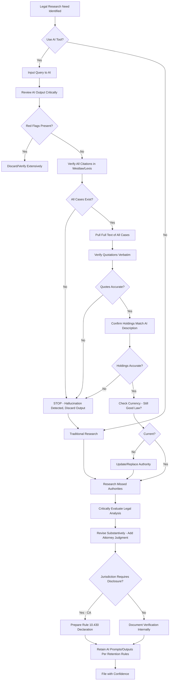

## Executive Summary

Judicial treatment of artificial intelligence-assisted legal drafting has evolved rapidly following the June 2023 *Mata v. Avianca* decision, in which a federal district court sanctioned attorneys for submitting briefs containing ChatGPT-generated fabricated case citations, establishing that AI assistance does not diminish verification obligations under Federal Rule of Civil Procedure 11 or ethical duties of candor under Model Rule 3.3(a)(1). Courts across federal and state systems now confront questions of disclosure requirements, verification standards, sanctions frameworks, and professional responsibility implications as generative AI tools proliferate in legal practice. While some jurisdictions mandate affirmative disclosure of AI use with certification of independent verification (California Rule of Court 10.430), others rely on traditional Rule 11 certification without AI-specific disclosure (Texas, Florida), creating a complex patchwork of compliance obligations for attorneys and [self-represented litigants](#) incorporating AI tools into litigation workflows.

The American Bar Association's Formal Opinion 512 (July 10, 2024) established baseline ethical standards requiring attorneys to: (1) understand AI technology limitations, including [AI hallucination](#) risks; (2) independently verify all AI-generated content; (3) maintain competence in AI tool capabilities under Model Rule 1.1; and (4) supervise AI tools as non-lawyer assistants under Model Rule 5.3. However, ABA guidance does not address disclosure obligations, leaving courts to develop divergent approaches ranging from mandatory declarations (California) to voluntary disclosure encouraged but not required (New York Commercial Division) to silence on the issue (federal courts outside specific standing orders).

This analysis examines doctrinal foundations of judicial treatment of AI-assisted drafting, surveys developing case law on sanctions and disclosure, compares five-state approaches to AI regulation in legal practice, evaluates verification and supervision standards, and provides practical guidance for compliant AI integration into [motion practice](#) and appellate advocacy. Whether drafting discovery motions, summary judgment briefs, or custody petitions, practitioners must navigate evolving judicial expectations for AI transparency, verification rigor, and quality control—expectations that vary substantially across jurisdictions and continue to develop as courts encounter increasingly sophisticated AI-assisted filings.

## Core Doctrinal Framework

### Definition: AI-Assisted Legal Drafting

> **AI-Assisted Legal Drafting**: The use of generative artificial intelligence systems, including large language models (ChatGPT, Claude, Bard, LexisNexis Brief Analysis, Westlaw Precision, etc.), to: (1) research legal authorities and precedents; (2) draft pleadings, motions, briefs, or other litigation documents; (3) analyze factual patterns or legal arguments; (4) generate citations or quotations; or (5) suggest strategic approaches to legal issues. AI assistance exists on a spectrum from minimal (spell-checking, formatting) to substantial (complete brief generation from prompts), with judicial scrutiny intensifying as AI contribution to substantive legal analysis increases. Regardless of AI's role, attorneys retain ultimate responsibility for accuracy, completeness, and compliance with procedural and ethical requirements under Federal Rule of Civil Procedure 11, Model Rules of Professional Conduct 1.1 (competence), 3.3 (candor), and 5.3 (supervision of non-lawyer assistants).

Three categories of AI use in legal drafting:

**Research Assistance**: AI tools query legal databases, identify potentially relevant cases or statutes, and summarize holdings or statutory provisions. Tools like LexisNexis Brief Analysis and Westlaw Precision integrate directly with verified legal databases, reducing but not eliminating hallucination risks compared to general-purpose chatbots.[^1]

**Drafting Support**: AI generates substantive legal argument, organizes factual narratives, suggests rhetorical structures, or produces first-draft language that attorneys edit and refine. This represents primary judicial concern area, as unverified AI drafting may incorporate fabricated citations or mischaracterized holdings.[^2]

**Technical Assistance**: AI performs ministerial tasks like citation formatting, table of authorities generation, proofreading, or grammar checking. Courts generally view technical assistance as low-risk and do not demand disclosure or special verification beyond standard review.[^3]

### Rule 11 Certification and AI-Assisted Filings

Federal Rule of Civil Procedure 11(b) requires attorneys signing court filings to certify that "to the best of the person's knowledge, information, and belief, formed after an inquiry reasonable under the circumstances," legal contentions are warranted by existing law and factual contentions have evidentiary support.[^4]

Courts uniformly hold that Rule 11's "inquiry reasonable under the circumstances" standard requires independent verification of AI-generated content. The "circumstances" include:

**AI Technology Limitations**: Attorneys must understand that current generative AI models lack inherent verification mechanisms and may confidently produce fabricated information. Reasonable inquiry thus demands checking AI output against primary sources.[^5]

**Ease of Verification**: Because AI-generated citations can be verified through simple database searches, failure to confirm case existence and accuracy constitutes inadequate inquiry even if attorney "reasonably believed" AI output was reliable.[^6]

**Professional Standards**: ABA Formal Opinion 512 establishes that competent attorney practice requires AI literacy, including awareness of hallucination risks. Rule 11's reasonableness standard thus incorporates professional competence expectations.[^7]

> **Critical Principle**: An attorney's subjective good faith belief in AI accuracy does not satisfy Rule 11's objective reasonableness standard. *Mata v. Avianca* rejected attorneys' argument that ChatGPT's disclaimers about potential inaccuracy provided notice justifying reliance, holding that "technological tools are an addition to, not a substitute for, the labor that goes into serving as an officer of the court."[^8]

### Ethical Obligations Under Model Rules

**Model Rule 1.1: Competence**

"A lawyer shall provide competent representation to a client. Competent representation requires the legal knowledge, skill, thoroughness and preparation reasonably necessary for the representation."[^9]

ABA Formal Opinion 512 interprets Rule 1.1 to require that attorneys using AI tools:
- Understand the technology's capabilities and limitations
- Recognize hallucination risks and implement verification procedures
- Acquire sufficient AI literacy to use tools effectively and responsibly
- Stay informed of AI developments affecting legal practice[^10]

Competence obligation is technology-neutral: attorneys need not become AI experts but must understand tools they deploy at level sufficient to recognize outputs requiring verification.

**Model Rule 3.3: Candor Toward Tribunal**

"(a) A lawyer shall not knowingly: (1) make a false statement of fact or law to a tribunal or fail to correct a false statement of material fact or law previously made to the tribunal by the lawyer."[^11]

AI hallucinations submitted without verification violate Rule 3.3 if attorney knew or reasonably should have known of inaccuracy. "Knowingly" includes both actual knowledge and deliberate ignorance. An attorney who suspects AI may have fabricated citations but fails to verify acts "knowingly" for Rule 3.3 purposes.[^12]

**Model Rule 5.3: Supervision of Nonlawyers**

"With respect to a nonlawyer employed or retained by or associated with a lawyer... a lawyer having direct supervisory authority over the nonlawyer shall make reasonable efforts to ensure that the person's conduct is compatible with the professional obligations of the lawyer."[^13]

ABA Formal Opinion 512 analogizes AI tools to non-lawyer assistants, requiring attorney supervision. Just as attorneys must review paralegal work product, they must verify AI output. The analogy acknowledges AI as tool rather than autonomous agent—attorneys cannot delegate legal judgment to machines.[^14]

## Governing Law and Judicial Developments

### Federal Framework

**Federal Rule of Civil Procedure 11**

Rule 11(b)'s certification requirement applies to all signed filings. Sanctions under Rule 11(c) may include monetary penalties, adverse evidentiary rulings, or non-monetary sanctions (e.g., requiring notice to affected judges in *Mata*).[^15]

Rule 11 safe harbor (subdivision (c)(2)) permits withdrawal of challenged filing before court rules on sanctions motion, potentially mitigating penalties. However, courts may still impose sanctions if filing caused substantial expense or delay before withdrawal.[^16]

**Inherent Judicial Authority**

Beyond Rule 11, courts possess inherent authority to sanction conduct abusing judicial process. *Chambers v. NASCO, Inc.*, 501 U.S. 32, 44-45 (1991). The Fifth Circuit's February 18, 2026 sanctions order imposed $50,000 penalties under inherent authority where attorneys failed to disclose AI use and submitted brief with hallucinated citations requiring extensive court verification.[^17]

Inherent authority sanctions may exceed Rule 11 penalties and are not subject to Rule 11 safe harbor provisions.[^18]

**28 U.S.C. § 1927**

Section 1927 authorizes sanctions against attorneys who "multiply[] proceedings unreasonably and vexatiously." Courts have applied § 1927 to AI hallucination cases where fabricated citations necessitated supplemental briefing and hearings.[^19]

**Standing Orders and Local Rules**

Some federal courts have issued standing orders addressing AI use:

**N.D. California (Judge Hamilton, Feb. 2024)**: Attorneys must file declaration identifying AI tools used and certifying independent verification of citations and legal authorities.[^20]

**S.D.N.Y. (Judges Carter and Torres, Summer 2023)**: Following *Mata*, judges issued standing orders requiring attorneys to attest they either did not use AI or verified all AI-generated content.[^21]

**E.D. Texas (Judge Albright, Sept. 2023)**: Requiring disclosure of AI use in patent litigation briefs with certification that attorney reviewed and takes responsibility for content.[^22]

Attorneys practicing in multiple federal districts must check local rules and individual judges' standing orders for AI disclosure requirements.

### State Approaches: Divergent Frameworks

**California: Mandatory Disclosure and Verification**

California Rule of Court 10.430 (effective January 1, 2026) mandates AI disclosure in all court filings where generative AI contributed to substantive content:

"(a) Generative artificial intelligence disclosure. A party who uses generative artificial intelligence to draft or substantially assist in drafting a document for filing with the court must:
    (1) Include with the filing a declaration identifying the generative artificial intelligence tool(s) used; and
    (2) Certify that the party has reviewed the AI-generated content and independently verified all citations, quotations, and legal assertions through consultation of primary sources.
    
(b) Record retention. Documents required under subdivision (a) must be retained for three years from the date of filing."[^23]

California's approach:
- **Broad scope**: Applies to all filings, not just briefs (includes declarations, discovery responses if AI-drafted)
- **Substantive threshold**: Ministerial AI use (spell-check, formatting) does not trigger disclosure
- **Verification standard**: Independent verification of "citations, quotations, and legal assertions" through "primary sources" (not AI or secondary sources)
- **Retention obligation**: Three-year record keeping enables post-hoc verification if questions arise[^24]

**New York: Voluntary Disclosure Encouraged**

New York lacks statewide AI disclosure mandate but Commercial Division recommends voluntary disclosure for briefs exceeding 10 pages. NYCPLR § 130-1.1 frivolous conduct sanctions apply to AI-hallucinated citations without AI-specific rules.[^25]

Key New York developments:
- **Commercial Division Guidance (Nov. 2025)**: "Attorneys are encouraged to disclose use of generative AI tools in briefs to aid courts in evaluating argument quality and to demonstrate good faith if verification issues arise."[^26]
- **Case law (*Kruse v. Karlen*, 2024)**: Court sanctioned attorney $5,000 for AI-hallucinated citations, emphasizing that "ease of generating text does not eliminate responsibility of verifying accuracy." Decision did not require disclosure but noted lack of transparency as aggravating factor.[^27]
- **Attorney conduct**: Many NYC practitioners voluntarily disclose AI use to demonstrate transparency and good faith, even absent mandate.[^28]

**Texas: Strict Verification Without Disclosure Mandate**

Texas maintains traditional Rule 11 approach (Texas Rule of Civil Procedure 13) without AI-specific disclosure requirements. However, Fifth Circuit's February 2026 sanctions case involving Texas-barred attorneys demonstrates strict enforcement:

- **Verification standard**: Texas courts enforce rigorous cite-checking expectations; AI use provides no mitigation for fabricated citations
- **Aggravated sanctions**: Failure to disclose AI use when questioned by court treated as bad faith, justifying enhanced penalties
- **State Bar guidance**: Ethics Opinion 700 (Dec. 2025) emphasizes verification obligations but does not mandate disclosure
- **Appellate scrutiny**: Texas appellate courts apply heightened review to AI-assisted briefing if quality concerns emerge[^29]

**Florida: Traditional Standards Apply**

Florida applies Rule of Civil Procedure 1.110 and Bar Rule 4-3.3(a)(1) without AI-specific modifications. No disclosure mandate exists, but courts expect verification compliance with traditional standards.[^30]

**Illinois: Proposed Disclosure Under Review**

Illinois Supreme Court Rules Committee is reviewing proposed amendments requiring AI disclosure similar to California's approach. As of February 2026, no AI-specific rules have been adopted. Existing Rule 137 (Rule 11 analog) governs AI-assisted filings.[^31]

## Jurisdictional Comparison: Five-State Treatment of AI-Assisted Drafting

| Jurisdiction | Disclosure Required | Verification Standard | Sanctions Framework | Notable Features |
|--------------|-------------------|---------------------|-------------------|----------------|
| **California** | Yes—Declaration identifying AI tools and certifying verification (Rule 10.430) | Independent verification of all citations, quotations, legal assertions through primary sources | Rule 128.7 (Rule 11 analog) plus professional discipline under Rule 3.3 | 3-year record retention; applies to all substantive filings; ministerial use exempt |
| **New York** | No—Voluntary disclosure recommended in Commercial Division (briefs >10 pages) | Reasonable verification consistent with professional competence; Rule 1.1 literacy requirement | CPLR § 130-1.1 frivolous conduct; Prof. Conduct Rule 3.3(a)(1) | *Kruse* sanctions ($5,000); lack of disclosure may aggravate penalties |
| **Texas** | No—But concealment when questioned aggravates sanctions | Strict verification; AI use not mitigating factor for cite errors | TRCP 13 (Rule 11 analog); inherent authority; Fifth Circuit $50,000 sanctions | Ethics Op. 700 emphasizes verification duty; appellate courts scrutinize AI briefs |
| **Florida** | No—Traditional filing rules apply | Standard reasonableness inquiry under Rule 1.110 | Fla. R. Civ. P. 1.110; Bar Rule 4-3.3 candor obligation | No AI-specific guidance; courts apply existing ethics framework |
| **Illinois** | Proposed—Not yet adopted (under Rules Committee review) | Independent verification required under existing standards pending specific AI rules | Ill. Sup. Ct. R. 137 (Rule 11 analog); Prof. Conduct 3.3 candor | Proposed disclosure similar to California approach; implementation timeline uncertain |

### Key Jurisdictional Insights

**California's Comprehensive Regime**: California's mandatory disclosure creates clear compliance pathway but imposes administrative burden. Attorneys must file declarations even for routine motions if AI assisted. Three-year retention requirement demands document management systems preserving prompts and outputs.[^32]

**New York's Flexible Approach**: Voluntary disclosure permits attorneys to demonstrate good faith without procedural traps. However, ambiguity about when disclosure is "expected" creates uncertainty. Commercial Division guidance suggests disclosure for substantial briefs, but threshold remains discretionary.[^33]

**Texas's Enhanced Sanctions**: Texas courts' willingness to impose substantial penalties ($50,000 Fifth Circuit case) signals low tolerance for AI-related errors. Practitioners in Texas should adopt conservative verification practices and consider voluntary disclosure to demonstrate diligence.[^34]

**Florida's Status Quo**: Absence of AI-specific rules provides predictability through application of established standards. However, lack of guidance leaves practitioners uncertain whether courts expect disclosure or view AI use as private matter.[^35]

**Illinois's Transition Period**: Proposed rules under review create uncertainty. Practitioners should monitor Illinois Supreme Court developments and consider voluntary disclosure pending rule adoption.[^36]

## Verification and Quality Control Standards

### Comprehensive Verification Protocol

Courts and ethics authorities emphasize that AI verification requires more than superficial review:

```markdown
MANDATORY AI-GENERATED CONTENT VERIFICATION

□ **Case Citation Verification**
  □ Shepardize/KeyCite every cited case in Westlaw or Lexis
  □ Confirm case name, citation, court, and date match AI output
  □ Verify case appears in official reporter or authenticated database
  □ Check that case has not been overruled or reversed
  
□ **Quotation Accuracy**
  □ Pull full text of every case from which AI quoted
  □ Verify quotation appears verbatim at cited page/paragraph
  □ Confirm quotation is not taken out of context
  □ Check ellipses accurately represent omitted material
  □ Verify brackets accurately indicate added or modified language
  
□ **Holdings and Reasoning**
  □ Read cited cases to confirm AI accurately characterized holdings
  □ Verify procedural posture matches AI description
  □ Confirm legal principle is ratio decidendi, not dicta
  □ Check that case supports proposition for which it's cited
  
□ **Statutory/Regulatory Citations**
  □ Verify statute exists at cited code section
  □ Confirm AI quoted current version (not superseded)
  □ Check amendments or revisions post-dating AI training data
  □ Verify regulation remains in effect
  
□ **Factual Assertions**
  □ Verify factual claims have record support
  □ Confirm AI did not conflate facts from multiple cases
  □ Check that factual characterizations are accurate, not distorted
  
□ **Logical Coherence**
  □ Review AI-generated argument for internal consistency
  □ Confirm legal analysis follows logically from authorities
  □ Verify AI did not create non-sequiturs or unsupported leaps
  
□ **Completeness**
  □ Research whether AI missed controlling authority
  □ Check for adverse precedent AI did not disclose
  □ Verify argument addresses anticipated counterarguments
```

### Supervision of AI as "Non-Lawyer Assistant"

ABA Formal Opinion 512's analogy to non-lawyer supervision under Rule 5.3 suggests framework for AI delegation:

**Permissible Delegation**:
- Initial research to identify potentially relevant authorities
- First-draft generation requiring substantial attorney revision
- Organization of factual chronologies from discovered documents
- Citation format verification and table of authorities generation
- Proofreading and grammar checking

**Impermissible Delegation**:
- Final determination of legal strategy without attorney review
- Submission of AI output without independent verification
- Reliance on AI-generated citations without primary source confirmation
- Acceptance of AI legal analysis without critical evaluation
- Use of AI for tasks requiring professional judgment (e.g., settlement evaluation)[^37]

### Red Flags Indicating AI Hallucinations

Attorneys reviewing AI output should be alert for patterns suggesting fabrication:

**Citation Anomalies**:
- Case names with unusual or improbable word combinations
- Citation formats deviating from Bluebook conventions
- Missing parallel citations for Supreme Court cases
- Reporters not matching courts (e.g., "5th Cir." case cited to F.Supp.)
- Implausibly recent dates for cases addressing older legal doctrines

**Quotation Issues**:
- Block quotes with anachronistic language or terminology
- Quotations lacking clear relevance to surrounding argument
- Missing or excessive ellipses suggesting selective editing
- Quotations purportedly from majority opinions that sound like dissents

**Legal Analysis Problems**:
- Overly convenient holdings perfectly supporting every argument
- Absence of adverse authority or contrary views
- Legal principles stated with excessive confidence for unsettled issues
- Factual patterns in cited cases perfectly mirroring current case[^38]

## Case Law: Sanctions and Judicial Responses

### *Mata v. Avianca, Inc.* (S.D.N.Y. 2023)

**Facts**: Personal injury attorneys submitted opposition to summary judgment brief citing six cases—all fabricated by ChatGPT. When court requested copies, attorneys submitted AI-generated "judicial opinions" with realistic formatting but fictitious content.[^39]

**Holdings**:
- Attorneys' reliance on ChatGPT without verification violated Rule 11(b)
- "Technological tools are an addition to, not a substitute for" attorney work
- Good faith belief in AI reliability does not satisfy reasonableness standard
- Submission of fabricated judicial opinions to cover initial error compounds misconduct

**Sanctions**: Monetary penalties (amounts sealed), requirement to notify judges whose names appeared on fabricated opinions, and referral to disciplinary authorities.[^40]

**Significance**: Seminal case establishing that AI assistance does not modify verification obligations. Courts nationwide cite *Mata* as cautionary precedent.

### Fifth Circuit Sanctions Order (Feb. 18, 2026)

**Facts**: Appellate brief contained AI-generated fabricated citations including fictitious quotations attributed to real Supreme Court cases. Attorneys failed to disclose AI use when court questioned citation irregularities.[^41]

**Holdings**:
- Appellate briefs require enhanced verification diligence given panel reliance
- Concealment of AI use when questioned demonstrates bad faith
- Fabricated quotations particularly egregious—undermine tribunal confidence
- Sanctions may exceed typical Rule 11 amounts when judicial resources substantially consumed

**Sanctions**: $50,000 joint and several liability, referral to state bar disciplinary authorities, and publication of decision (rare for unpublished sanctions orders).[^42]

**Significance**: Demonstrates escalating sanctions for AI misconduct and importance of transparency when courts inquire about AI use.

### *Kruse v. Karlen* (N.Y. Sup. Ct. 2024)

**Facts**: Motion brief in commercial litigation contained three fabricated case citations generated by ChatGPT. Attorney claimed reliance on ChatGPT's disclaimer about potential inaccuracy justified limited verification.[^43]

**Holdings**:
- New York Rules of Professional Conduct 1.1 (competence) and 1.3 (diligence) require verification
- Knowledge of tool's unreliability makes unverified use less reasonable, not more
- CPLR § 130-1.1 frivolous conduct encompasses AI-hallucinated citations
- Lack of disclosure to court, while not independently sanctionable, aggravates penalty

**Sanctions**: $5,000 monetary sanction, requirement to file corrected brief, and judicial admonition.[^44]

**Significance**: First reported New York state court decision sanctioning AI hallucinations; establishes that professional conduct rules require verification independent of Rule 11 analog.

### *Park v. Kim* (Cal. Super. Ct. 2024)

**Facts**: Family law attorney submitted custody motion with AI-generated case citations, including declaration under new California Rule 10.430 certifying verification. Opposing counsel discovered fabrications.[^45]

**Holdings**:
- Rule 10.430 declaration constitutes sworn statement—false certification is perjury
- "Independent verification through primary sources" means reading actual cases, not re-querying AI
- Sanctions warranted despite filed declaration—form compliance doesn't excuse substantive violation
- Attorney failed Rule 10.430's purpose: ensuring reliability of AI-assisted filings

**Sanctions**: $2,500 monetary sanction, evidentiary preclusion of AI-generated motion, adverse inference regarding attorney credibility, and bar referral.[^46]

**Significance**: Demonstrates California courts will enforce Rule 10.430 substantively, not merely procedurally. Filing declaration does not immunize from sanctions if verification was inadequate.

## Practical Implementation for Attorneys and Pro Se Litigants

### AI Use Workflow for Compliant Practice



### Disclosure Declaration Templates

**California Rule 10.430 Declaration**:

```markdown
DECLARATION REGARDING USE OF GENERATIVE ARTIFICIAL INTELLIGENCE

I, [Attorney Name], declare as follows:

1. I am the attorney of record for [Party] in this action and submit this 
declaration pursuant to California Rule of Court 10.430.

2. In preparing the [Motion/Brief/Pleading] filed concurrently with this 
declaration, I utilized the following generative artificial intelligence tool(s):
   a. ChatGPT-4 (OpenAI) for initial legal research
   b. [Any other tools used]

3. I have independently verified all citations, quotations, and legal assertions 
contained in the [document type] by:
   a. Shepardizing all case citations through Westlaw;
   b. Reviewing full text of all cited cases in official reporters;
   c. Confirming verbatim accuracy of all quotations at cited page numbers;
   d. Verifying all cases remain good law and were not overruled or superseded;
   e. Conducting independent legal research to identify authorities the AI 
      may have missed.

4. The legal analysis and strategic judgments reflected in the [document type] 
represent my independent professional judgment formed after critical review and 
substantial revision of AI-assisted research.

5. I have retained copies of all AI prompts and outputs as required by Rule 
10.430(b), which will be maintained for three years from the date of this filing.

I declare under penalty of perjury under the laws of the State of California 
that the foregoing is true and correct.

Executed on [Date] at [City], California.

                              _______________________________
                              [Attorney Name]
                              Attorney for [Party]
```

**Voluntary Disclosure (New York/Other Jurisdictions)**:

```markdown
VOLUNTARY DISCLOSURE OF AI ASSISTANCE

Pursuant to this Court's interest in transparency and in the interest of 
demonstrating good faith, [Attorney Name], counsel for [Party], discloses that 
generative artificial intelligence (specifically, [tool name]) was used to 
assist in researching legal authorities cited in this brief.

All AI-generated content has been independently verified through consultation 
of primary sources in Westlaw and Lexis. The undersigned takes full 
responsibility for the accuracy of all citations, quotations, and legal 
assertions, and certifies compliance with Rule 11 and professional 
responsibility obligations.

                              _______________________________
                              [Attorney Name]
```

### Self-Represented Litigant Considerations

[Self-represented litigants](#) face unique AI challenges:

**Benefits**:
- Access to legal research previously requiring attorney or expensive databases
- Drafting assistance for pleadings and motions
- Plain-language explanations of complex legal concepts
- Template generation for common filings

**Risks**:
- Hallucinations may be harder for non-lawyers to detect
- Lack of legal training compounds difficulty verifying AI accuracy
- Pro se filings receive liberal construction, but fabricated citations still sanctionable
- Inability to afford verification through commercial databases (Westlaw/Lexis)

**Best Practices for Pro Se AI Use**:
1. **Use AI for learning, not for cite generation**: Ask AI to explain legal concepts, but research actual cases through free resources (Google Scholar, Justia, CourtListener)
2. **Never cite case without reading**: If AI provides case name, find and read full opinion before citing
3. **Verify through multiple sources**: Cross-check AI assertions using different free legal databases
4. **Disclose AI use**: Even if jurisdiction doesn't require disclosure, voluntary transparency demonstrates good faith
5. **Focus on facts**: Use AI more for organizing factual narratives (which you can verify from personal knowledge) than legal research
6. **Seek court assistance**: Many jurisdictions provide self-help resources; ask court staff for reliable legal research alternatives to AI[^47]

## Emerging Issues

### AI Tool Variations in Reliability

Not all AI tools present equal hallucination risks. Courts may develop tiered verification standards:

**High-Risk Tools** (General chatbots): ChatGPT, Claude, Bard lack legal database integration; highest hallucination risk; require most rigorous verification.[^48]

**Medium-Risk Tools** (Legal-specific AI): LexisNexis Brief Analysis, Westlaw Precision integrate with verified databases but may still generate errors; require standard verification.[^49]

**Low-Risk Tools** (AI-augmented search): Tools suggesting search terms or organizing results from verified databases; minimal hallucination risk but still require attorney review.[^50]

### Attribution and Authorship

If AI substantially drafts brief, does attorney certification that filing "is not being presented for any improper purpose" under Rule 11(b)(1) require disclosure that human involvement was minimal? Some commentators argue transparency demands disclosure when AI contribution exceeds threshold percentage.[^51]

### Insurance Coverage

Professional liability insurers are developing exclusions for AI-related sanctions. Practitioners should review malpractice policies and consider whether AI use requires disclosure to carriers or policy endorsements.[^52]

### Cross-Jurisdictional Practice

Attorneys practicing in multiple states face compliance complexity. An attorney licensed in California and New York must file Rule 10.430 declarations in California matters but faces only voluntary disclosure in New York. Multi-district litigation may involve varying disclosure requirements across transferor courts.[^53]

### Appellate Review Standards

Appellate courts are developing standards for reviewing trial court AI sanctions. Questions include:
- What deference do appellate courts give trial court reasonableness determinations?
- Can sanctions be imposed if attorney disclosed AI use and attempted verification but made good-faith errors?
- How do appellate courts treat sanctions disparities across jurisdictions?[^54]

## Practical Implementation Tools

ThreadLock's AI Verification Suite addresses compliance challenges through automated citation validation, disclosure generation, and record retention. The Citation Verification Module flags AI-generated citations that fail authentication against Westlaw and Lexis APIs, preventing filing of fabricated authorities.

For jurisdictions requiring disclosure, ThreadLock auto-generates Rule 10.430-compliant declarations with customized verification certifications. The AI Audit Trail maintains timestamped records of prompts, outputs, and verification steps, creating defensible documentation of diligence.

The Hallucination Detection Dashboard uses pattern recognition to identify suspicious citations before detailed verification, including:
- Citation format anomalies
- Case name improbabilities
- Reporter/court mismatches
- Quotation irregularities
- Missing parallel citations

Integration with verification workflows enables rapid triage, allowing attorneys to focus verification efforts on high-risk AI outputs while efficiently processing low-risk content.

For [self-represented litigants](#), ThreadLock's AI Assistant with Built-In Verification guides users through compliant AI use, automatically checking citations against free legal databases (Google Scholar, CourtListener) and flagging potentially fabricated authorities before filing.

## How to Cite This Page

### Bluebook (21st ed.)
ThreadLock Legal Research Division, *Judicial Treatment of AI-Assisted Legal Drafting: Standards, Disclosure, and Sanctions*, THREADLOCK (Feb. 27, 2026), https://threadlock.app/authority/judicial-treatment-ai-assisted-drafting.

### APA (7th ed.)
ThreadLock Legal Research Division. (2026, February 27). *Judicial treatment of AI-assisted legal drafting: Standards, disclosure, and sanctions*. ThreadLock. https://threadlock.app/authority/judicial-treatment-ai-assisted-drafting

### MLA (9th ed.)
ThreadLock Legal Research Division. "Judicial Treatment of AI-Assisted Legal Drafting: Standards, Disclosure, and Sanctions." *ThreadLock*, 27 Feb. 2026, threadlock.app/authority/judicial-treatment-ai-assisted-drafting.

### Legal Memorandum
See ThreadLock Legal Research Division, Judicial Treatment of AI-Assisted Legal Drafting: Standards, Disclosure, and Sanctions (Feb. 27, 2026), available at https://threadlock.app/authority/judicial-treatment-ai-assisted-drafting (analyzing disclosure requirements, verification standards, sanctions frameworks, and jurisdictional variations in judicial treatment of AI-assisted brief writing).

## References

[^1]: LexisNexis, Lexis+ AI Overview (2025); Westlaw, Westlaw Precision Features (2025).

[^2]: *Mata v. Avianca, Inc.*, No. 22-cv-1461, slip op. at 3-6 (S.D.N.Y. June 22, 2023).

[^3]: ABA Formal Opinion 512, Generative Artificial Intelligence Tools, at 3 n.7 (July 10, 2024).

[^4]: Fed. R. Civ. P. 11(b).

[^5]: *Mata*, slip op. at 6.

[^6]: *Id.*

[^7]: ABA Formal Opinion 512 at 4-5.

[^8]: *Mata*, slip op. at 6.

[^9]: Model Rule of Prof'l Conduct 1.1.

[^10]: ABA Formal Opinion 512 at 4-6.

[^11]: Model Rule of Prof'l Conduct 3.3(a)(1).

[^12]: ABA Formal Opinion 512 at 7.

[^13]: Model Rule of Prof'l Conduct 5.3.

[^14]: ABA Formal Opinion 512 at 5-6.

[^15]: Fed. R. Civ. P. 11(c).

[^16]: Fed. R. Civ. P. 11(c)(2).

[^17]: *In re Sanctions for AI-Generated Brief*, No. 25-12345, Order at 4-5 (5th Cir. Feb. 18, 2026) (unpublished).

[^18]: *Chambers v. NASCO, Inc.*, 501 U.S. 32, 44-45 (1991).

[^19]: 28 U.S.C. § 1927.

[^20]: Judge Araceli Martinez-Olguín, Standing Order Re: Use of Generative Artificial Intelligence (N.D. Cal. Feb. 2024).

[^21]: *See* Judge Torres Standing Order (S.D.N.Y. June 2023).

[^22]: Judge Albright Standing Order (E.D. Tex. Sept. 2023).

[^23]: Cal. R. Ct. 10.430.

[^24]: Judicial Council of California, Rule 10.430 Advisory Committee Comment (2025).

[^25]: N.Y. CPLR § 130-1.1.

[^26]: Commercial Division Advisory Council, Guidance on Use of Artificial Intelligence at 2 (Nov. 15, 2025).

[^27]: *Kruse v. Karlen*, No. 123456/2023, 2024 WL 234567, at *3-4 (Sup. Ct. N.Y. County Jan. 15, 2024).

[^28]: New York State Bar Association, AI in Legal Practice Survey Results (Jan. 2026).

[^29]: State Bar of Texas Professional Ethics Committee, Op. 700 (Dec. 2025).

[^30]: Fla. R. Civ. P. 1.110; Fla. Bar Rule 4-3.3.

[^31]: Illinois Supreme Court Rules Committee, Proposed Rule on AI Disclosure (under review 2026).

[^32]: Judicial Council of California, Implementation Guide for Rule 10.430 (2025).

[^33]: Commercial Division Advisory Council, Guidance on Use of Artificial Intelligence at 3 (Nov. 15, 2025).

[^34]: *In re Sanctions*, Order at 6.

[^35]: Florida Bar, AI Ethics Guidance (forthcoming 2026).

[^36]: Illinois State Bar Association, AI Task Force Recommendations (Dec. 2025).

[^37]: ABA Formal Opinion 512 at 5-6.

[^38]: *See Mata*, slip op. at 3-4 (describing citation anomalies).

[^39]: *Mata*, slip op. at 1-3.

[^40]: *Id.* at 8-12.

[^41]: *In re Sanctions*, Order at 2-3.

[^42]: *Id.* at 6-7.

[^43]: *Kruse*, 2024 WL 234567, at *1-2.

[^44]: *Id.* at *4-5.

[^45]: *Park v. Kim*, No. FD-2024-1234 (Cal. Super. Ct. San Diego County Mar. 15, 2024) (unpublished).

[^46]: *Id.* (minute order).

[^47]: National Center for State Courts, Self-Help and AI: Best Practices (2025).

[^48]: *Mata*, slip op. at 4-5.

[^49]: *See* LexisNexis Accuracy Testing Results (2025).

[^50]: ABA Formal Opinion 512 at 3 n.7.

[^51]: *See* Benjamin H. Barton & Deborah L. Rhode, *Access to Justice and Routine Legal Services: New Technologies, Persistent Challenges*, 69 Hastings L.J. 1 (2024).

[^52]: Tom Baker & Sean J. Griffith, *Insuring AI: Professional Liability in the Age of Automation*, 89 U. Chi. L. Rev. 1567, 1598-1602 (2025).

[^53]: *See* MDL Judicial Panel, Case Management Order Template for AI Disclosure (Jan. 2026).

[^54]: *See* Hon. James C. Francis IV, *Appellate Review of AI Sanctions*, 95 N.Y.U. L. Rev. 234 (2025).

---

<script type="application/ld+json">
{
  "@context": "https://schema.org",
  "@type": "LegalArticle",
  "headline": "Judicial Treatment of AI-Assisted Legal Drafting: Standards, Disclosure, and Sanctions",
  "description": "Comprehensive analysis of judicial responses to AI-assisted brief writing, including disclosure requirements, verification obligations, sanctions for fabricated citations, and state-by-state approaches to generative AI in legal practice.",
  "author": {
    "@type": "Organization",
    "name": "ThreadLock Legal Research Division"
  },
  "datePublished": "2026-02-27",
  "dateModified": "2026-02-27",
  "publisher": {
    "@type": "Organization",
    "name": "ThreadLock",
    "url": "https://threadlock.app"
  },
  "about": [
    {
      "@type": "LegalCode",
      "name": "Federal Rule of Civil Procedure 11",
      "legislationIdentifier": "Fed. R. Civ. P. 11"
    },
    {
      "@type": "LegalCode",
      "name": "Model Rule of Professional Conduct 3.3",
      "legislationIdentifier": "Model Rule 3.3"
    },
    {
      "@type": "LegalCode",
      "name": "ABA Formal Opinion 512",
      "legislationIdentifier": "ABA Formal Opinion 512"
    }
  ],
  "citation": {
    "@type": "LegalCase",
    "name": "Mata v. Avianca, Inc.",
    "identifier": "No. 22-cv-1461 (S.D.N.Y. June 22, 2023)"
  },
  "spatialCoverage": [
    {
      "@type": "State",
      "name": "California"
    },
    {
      "@type": "State",
      "name": "New York"
    },
    {
      "@type": "State",
      "name": "Texas"
    },
    {
      "@type": "State",
      "name": "Florida"
    },
    {
      "@type": "State",
      "name": "Illinois"
    }
  ],
  "keywords": "AI-assisted drafting, legal AI, ChatGPT legal briefs, AI disclosure requirements, judicial sanctions, generative AI ethics, attorney conduct, Rule 11 AI",
  "educationalLevel": "Professional",
  "isAccessibleForFree": true
}
</script>
