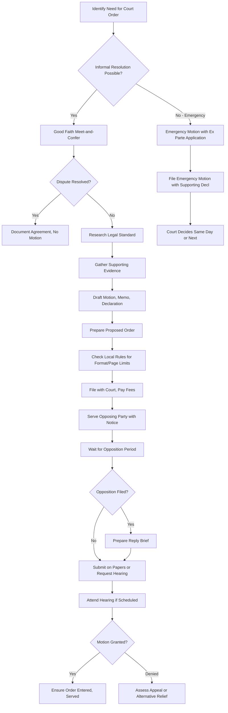

## Executive Summary

Self-represented litigants—parties proceeding without counsel in civil, family, or administrative proceedings—exercise a constitutional and statutory right recognized under 28 U.S.C. § 1654 but face significant procedural challenges in navigating motion practice requirements that courts apply with varying degrees of accommodation. While the Supreme Court in *Haines v. Kerner*, 404 U.S. 519 (1972), established that pro se pleadings must be "held to less stringent standards than formal pleadings drafted by lawyers" and construed liberally, this principle of liberal construction does not excuse compliance with fundamental procedural requirements including proper notice, service, evidentiary support, and coherent legal argument. The tension between access to justice concerns and procedural integrity creates a complex landscape where [self-represented litigants](#) must understand both formal motion requirements and the practical accommodations courts may (or may not) provide.

For pro se parties in family court custody disputes, civil rights litigation, or consumer matters, effective motion practice requires mastery of jurisdiction-specific filing requirements, understanding of burden allocation and evidentiary standards, strategic selection of motion types, and ability to present factual and legal arguments in formats courts can efficiently process. Motion practice encompasses discovery disputes (Fed. R. Civ. P. 26, 37), summary judgment proceedings (Fed. R. Civ. P. 56), evidentiary motions in limine, and case management applications—each governed by distinct standards and supported by different evidentiary showing requirements. Jurisdictional variations compound complexity: California provides extensive pro se assistance and relaxed formatting requirements; Texas enforces strict compliance with local rules; New York's Commercial Division maintains attorney-equivalent standards while Family Court provides substantial accommodation.

This analysis examines doctrinal foundations of the right to self-representation, procedural standards governing motion practice, jurisdictional comparison of pro se accommodation across five key states, motion-type specific requirements, and practical implementation tools for effective advocacy without counsel. Whether filing a motion to compel discovery, opposing summary judgment, or seeking modification of custody orders, understanding what courts expect—and what procedural shortcuts courts will tolerate—determines success in navigating motion practice pro se.

## Core Doctrinal Framework

### Definition: Self-Represented Litigant Status

> **Self-Represented Litigant (Pro Se)**: An individual conducting litigation personally without representation by licensed attorney, exercising the right recognized in 28 U.S.C. § 1654 ("In all courts of the United States the parties may plead and conduct their own cases personally or by counsel"). Pro se status confers: (1) right to access courts without attorney representation; (2) entitlement to liberal construction of pleadings and filings under *Haines v. Kerner*, 404 U.S. 519 (1972); (3) responsibility for compliance with procedural rules applicable to represented parties, subject to reasonable accommodation; and (4) protection against bad-faith litigation conduct through Rule 11 sanctions frameworks applied with consideration of pro se status. Self-representation does not constitute legal disability or incompetence but reflects resource constraints, distrust of legal system, or personal preference for direct control over litigation strategy.

The doctrinal foundation balances three principles:

**Access to Justice**: Courts must not erect barriers preventing unrepresented parties from pursuing or defending claims. *Bounds v. Smith*, 430 U.S. 817, 828 (1977) (access to courts is fundamental right).

**Procedural Integrity**: Self-representation does not excuse compliance with neutral rules ensuring orderly administration of justice. *McNeil v. United States*, 508 U.S. 106, 113 (1993) (pro se status does not exempt parties from procedural requirements).

**Liberal Construction**: When procedural ambiguity exists or inadvertent error occurs, courts resolve doubts in favor of pro se litigants. *Hughes v. Rowe*, 449 U.S. 5, 9-10 (1980) (pro se complaints liberally construed).

### The *Haines v. Kerner* Standard

The seminal pronouncement on pro se accommodation appears in *Haines v. Kerner*: "we hold [pro se] complaints to less stringent standards than formal pleadings drafted by lawyers."[^1] Courts have extended this principle beyond complaints to motions, oppositions, and other litigation papers.

Liberal construction entails:
- **Reading filings charitably** to discern intended arguments
- **Overlooking technical defects** in formatting, citation, or organization
- **Identifying cognizable legal theories** even if not explicitly pleaded
- **Permitting amendment** to cure deficiencies rather than dismissing
- **Providing procedural guidance** when feasible without crossing into advocacy

However, *Haines* does not permit:
- **Ignoring jurisdictional requirements** (standing, timeliness, subject matter jurisdiction)
- **Excusing failure to state cognizable claims** under governing substantive law
- **Waiving evidentiary requirements** for motions requiring factual support
- **Transforming judges into advocates** by developing legal theories for parties
- **Permitting meritless litigation** that would be sanctionable if counsel-filed[^2]

### Procedural Accommodation vs. Substantive Advantage

Courts distinguish between procedural accommodation (permitted) and substantive advantage (prohibited). Pro se litigants receive:

**Procedural**: Extended filing deadlines upon showing good cause; permission to amend defective motions; informal notice of deficiencies before dismissal; flexibility in formatting and citation; assistance from court clerks on procedural mechanics (where to file, what forms to use).

**Not Substantive**: Relaxed burden of proof; different evidence admissibility standards; immunity from sanctions for bad-faith conduct; reduced showing for provisional remedies; different substantive legal standards.[^3]

## Governing Law

### Federal Framework

**28 U.S.C. § 1654: Right to Self-Representation**

"In all courts of the United States the parties may plead and conduct their own cases personally or by counsel as, by the rules of such courts, respectively, are permitted to manage and conduct causes therein."[^4]

This statutory right permits self-representation in federal civil litigation but does not extend to representing others (unauthorized practice of law). Corporations generally must be represented by counsel. *Rowland v. Cal. Men's Colony*, 506 U.S. 194, 202 (1993).

**Federal Rule of Civil Procedure 7: Motion Requirements**

FRCP 7(b)(1) establishes baseline motion requirements: "A request for a court order must be made by motion. The motion must: (A) be in writing unless made during a hearing or trial; (B) state with particularity the grounds for seeking the order; and (C) state the relief sought."[^5]

Pro se motions must satisfy these elements but receive liberal construction regarding "particularity" when substantive grounds are discernible even if inartfully stated.[^6]

**Federal Rule of Civil Procedure 11: Certification and Sanctions**

Rule 11(b) requires every filing to be signed, certifying reasonable inquiry and legal/factual basis. Courts apply Rule 11 to pro se litigants but with consideration of limited legal knowledge. Sanctions typically require warning and opportunity to withdraw before imposition.[^7]

**Federal Rule of Civil Procedure 56: Summary Judgment**

Summary judgment motions require showing "there is no genuine dispute as to any material fact." FRCP 56(c). Pro se parties opposing summary judgment receive notice of burden and opportunity to respond, but must produce admissible evidence creating factual disputes—legal ignorance does not excuse failure to designate evidence.[^8]

### State Frameworks

**California**

California Code of Civil Procedure § 1062 mirrors federal self-representation right. California Rules of Court provide extensive pro se accommodation:

**Rule 3.1300**: Motion Requirements—Pro se motions must include notice, memorandum of points and authorities, declarations, and proposed orders, but courts accept substantial compliance rather than demanding technical perfection.[^9]

**Rule 2.30**: Self-Help Centers—California courts must provide self-help services assisting with forms, procedural requirements, and resource referrals (not legal advice).[^10]

**Rule 10.960**: Access to Justice—Courts implement programs ensuring meaningful access for self-represented litigants, including simplified forms and instructional materials.[^11]

**California Family Code § 6221**: Family Court Accommodation—In domestic violence and custody cases, courts provide assistance navigating procedural requirements and may appoint facilitators to help complete forms.[^12]

**New York**

CPLR § 321(a) permits self-representation. New York distinguishes between Commercial Division (attorney-equivalent standards) and Family Court (substantial accommodation):

**22 NYCRR § 202.7**: Motion Practice—Strict compliance required in Supreme Court: notice of motion, affidavits, memorandum of law. Pro se litigants receive some flexibility but less than California.[^13]

**Family Court Act § 262**: Assistance to Petitioners—Family Court provides forms, procedural information, and referrals. Judges may question witnesses to develop record when pro se parties lack examination skills.[^14]

**CPLR § 130-1.1**: Frivolous Conduct—Sanctions for frivolous motions apply to pro se parties but with heightened scrutiny before imposition.[^15]

**Texas**

Texas Rule of Civil Procedure 13 permits self-representation. Texas courts enforce procedural compliance strictly:

**Texas R. Civ. P. 21**: Motions must be in writing, state grounds with specificity, and include supporting affidavits when factual showing required.[^16]

**Texas Fam. Code § 6.408**: Pro Se Divorce—Texas provides standardized forms for uncontested divorces, but contested family law matters receive limited procedural accommodation.[^17]

**Texas R. App. P. 6.1**: Pro Se Appellate Procedure—Appellate courts construe pro se briefs liberally but require substantial compliance with briefing requirements.[^18]

**Florida**

Florida Statute § 57.105 permits self-representation with limited accommodation:

**Fla. R. Civ. P. 1.100**: Motion Requirements—Pro se motions must comply with general requirements: written form, certificate of service, legal and factual basis.[^19]

**Fla. Fam. L. R. P. 12.100**: Family Law Forms—Florida provides Supreme Court-approved forms for common family law motions, substantially assisting pro se practice.[^20]

**Fla. R. Jud. Admin. 2.545**: Self-Help Programs—Courts may establish programs providing procedural information but not legal advice.[^21]

**Illinois**

735 ILCS 5/1-104 permits self-representation. Illinois provides moderate accommodation:

**Illinois Sup. Ct. R. 137**: Motion requirements parallel Federal Rule 11. Pro se motions receive liberal construction but must state legal basis and relief sought.[^22]

**750 ILCS 5/501**: Family Court Procedures—Illinois family courts may relax evidentiary rules to ensure fair hearings when parties lack legal sophistication.[^23]

**Illinois Sup. Ct. R. 13**: Simplified procedures for small claims and eviction cases, benefiting pro se litigants.[^24]

## Jurisdictional Comparison: Pro Se Motion Practice Standards

| Jurisdiction | Accommodation Level | Filing Requirements | Formatting Flexibility | Court Assistance | Notable Features |
|--------------|-------------------|-------------------|----------------------|----------------|----------------|
| **California** | High—Extensive pro se support infrastructure | Notice, memorandum, declarations, proposed order; substantial compliance accepted | Liberal—Courts overlook citation errors, formatting issues if substance clear | Mandatory self-help centers; form packages; facilitators in family court | Rule 2.30 self-help requirement; standardized Judicial Council forms; video tutorials |
| **New York** | Mixed—Family Court high, Commercial Division low | Notice of motion, affidavits, memo of law; formatting matters in Supreme Court | Moderate—Family Court flexible; Supreme Court less so | Self-help available but not mandated; LawHelp.org resources | Sharp distinction between court types; Family Court judges may develop record |
| **Texas** | Low—Strict procedural compliance expected | Written motion, specific grounds, supporting affidavits; local rule compliance critical | Limited—Citations expected; proper formatting required | Limited self-help; some counties offer form libraries | Forms for simple matters only; complex family law requires substantial compliance |
| **Florida** | Moderate—Strong form support, limited judicial flexibility | Written motion, certificate of service, factual/legal basis | Moderate—Forms provide structure; deviations accepted if justified | Self-help programs authorized (Rule 2.545); extensive Supreme Court-approved forms | Form-based system for family law; civil cases receive less support |
| **Illinois** | Moderate—Liberal construction with procedural expectations | Written motion, legal basis, relief sought; Rule 137 certification | Moderate—Substance over form, but coherent presentation expected | Self-help websites; some courthouse navigators | Simplified small claims procedures; standard family court forms available |

### Key Jurisdictional Insights

**California's Comprehensive Support**: California leads in pro se infrastructure through mandatory self-help centers (Rule 2.30), extensive Judicial Council forms covering motions from custody modification to discovery disputes, and judicial training on pro se accommodation. Self-represented family court litigants can complete most common motions using fill-in-the-blank forms with instructional guides.[^25]

**New York's Bifurcated Approach**: The sharp distinction between Commercial Division (sophisticated parties, attorney-equivalent expectations) and Family Court (vulnerable populations, extensive accommodation) creates challenges for pro se litigants in Supreme Court civil matters falling between these extremes.[^26]

**Texas's Formalism**: Texas courts enforce local rules strictly, and many counties maintain complex local motion requirements (font size, margin width, line spacing, pagination) that pro se litigants frequently violate. Substantive motions may be rejected for purely technical defects.[^27]

**Florida's Form-Driven System**: Florida Supreme Court-approved forms provide structured templates ensuring compliance with procedural requirements, dramatically reducing technical rejection rates. However, matters not covered by forms receive limited guidance.[^28]

**Illinois's Balanced Approach**: Illinois balances liberal construction with expectation that pro se litigants make genuine efforts to comply with procedural requirements. Courts provide opportunities to cure defects but will not indefinitely excuse noncompliance.[^29]

## Motion-Type Specific Requirements

### Discovery Motions (Motions to Compel, Protective Orders)

**Governing Rules**: Fed. R. Civ. P. 26, 37; state analogs

**Prerequisites**:
- **Good Faith Meet-and-Confer**: FRCP 37(a)(1) requires certification of good faith effort to resolve dispute before filing motion to compel. Pro se litigants must document attempted resolution through letters, emails, or phone calls.[^30]
- **Specific Identification**: Motion must identify specific discovery requests, objections, and responses at issue—general complaints of noncompliance insufficient.
- **Substantial Justification**: Moving party bears burden of showing discovery is relevant, proportional, and not unduly burdensome.

**Common Pro Se Errors**:
- Filing motion to compel immediately after objection without meet-and-confer attempt
- Requesting discovery exceeding scope (privileged materials, irrelevant information)
- Failing to attach copies of actual discovery requests and responses
- Seeking sanctions without demonstrating bad faith or substantial justification for resistance

**Accommodation**: Courts often provide detailed deficiency notices and opportunities to cure before denying discovery motions, recognizing pro se litigants may not understand proportionality standards.[^31]

### Summary Judgment Motions and Oppositions

**Governing Rules**: Fed. R. Civ. P. 56; state analogs

**Requirements for Movant**:
- Statement of undisputed material facts with record citations
- Legal memorandum demonstrating entitlement to judgment as matter of law
- Appendix of supporting evidence (declarations, deposition excerpts, documents)
- Proposed order

**Requirements for Opposition**:
- Responsive statement admitting/denying each fact with record citations
- Counter-statement of disputed facts with evidence support
- Legal memorandum showing genuine factual disputes preclude summary judgment
- Admissible evidence (declarations, not mere allegations)

**Pro Se Challenges**:
- Understanding difference between "evidence" (admissible declarations, documents) and "allegations" (unsupported assertions)
- Properly authenticating exhibits under [Evidence Authentication](#) standards
- Citing to specific portions of voluminous records (page and line numbers)
- Distinguishing material facts from immaterial details

**Accommodation**: Most courts provide *Rand v. Rowland*, 154 F.3d 952 (9th Cir. 1998), warning notices informing pro se non-movants of summary judgment standards and consequences of failure to respond with admissible evidence. Some courts conduct hearings allowing oral elaboration.[^32]

### Evidentiary Motions (Motions in Limine, Objections)

**Governing Rules**: Fed. R. Evid. 401-403; specific relevance and authenticity rules

**Requirements**:
- Identification of specific evidence to be excluded/admitted
- Legal basis for exclusion (hearsay, relevance, authenticity, privilege)
- Explanation of prejudice if evidence admitted/excluded
- Proposed limiting instruction if partial admission sought

**Pro Se Challenges**:
- Limited understanding of hearsay exceptions, relevance standards, authentication requirements
- Confusing evidentiary objections with disagreement about fact interpretation
- Failing to object timely (in limine motions must be filed pre-trial; trial objections must be contemporaneous)

**Accommodation**: Trial judges may explain evidentiary rulings and invite renewed objections if circumstances change, providing real-time education on [Digital Exhibit Admissibility](#) and authentication requirements.[^33]

### Family Law Motions (Modification, Contempt, Protective Orders)

**Governing Rules**: State family codes and local family court rules

**Common Types**:
- **Modification of Custody/Support**: Requires showing substantial change in circumstances
- **Contempt**: Requires proof of willful violation of court order
- **Protective Orders**: Requires showing imminent threat of harm
- **Discovery in Family Court**: Often informal but must comply with state discovery rules

**Pro Se Advantages**:
- Family courts provide most extensive accommodation and self-help resources
- Evidentiary rules relaxed to ensure complete record
- Judges may question witnesses to develop relevant facts
- Standardized forms available for most common motions

**Requirements Despite Accommodation**:
- Proper service on opposing party with notice of hearing
- Factual declarations supporting requested relief (not mere conclusory allegations)
- Compliance with mandatory disclosures ([Contemporaneous Record Doctrine](#) often critical)
- Financial affidavits with supporting documentation for support matters

**Best Practices**: Use jurisdiction's standardized forms; attach comprehensive evidentiary support ([Metadata as Evidence](#) for digital communications); document all compliance with parenting plans or support orders.[^34]

## Practical Motion Practice Framework

### Essential Components of Pro Se Motions

```markdown
UNIVERSAL MOTION STRUCTURE FOR PRO SE LITIGANTS

**CAPTION**
[Court Name]
[Case Name and Number]
[Document Title: MOTION FOR...]

**NOTICE OF MOTION**
PLEASE TAKE NOTICE that on [date], at [time], or as soon thereafter 
as the matter may be heard, [moving party] will move this Court for 
an order [state specific relief sought].

This motion is based on the attached Memorandum of Points and Authorities, 
the Declaration of [name], the files and records in this case, and any 
oral argument the Court may permit.

**MEMORANDUM OF POINTS AND AUTHORITIES**

I. INTRODUCTION
[One paragraph: who you are, what you're seeking, why entitled]

II. STATEMENT OF FACTS
[Chronological narrative of relevant facts, supported by evidence]
[Each assertion should cite to exhibit or declaration: (Decl. ¶ 5)]

III. LEGAL ARGUMENT
[State governing law with citations]
[Explain how facts satisfy legal standard]
[Address anticipated counterarguments]

IV. CONCLUSION
[Restate relief requested]

Dated: [Date]
Respectfully submitted,
[Your signature]
[Your name, address, phone, email]
Pro Se [Plaintiff/Defendant]

**DECLARATION OF [YOUR NAME]**

I, [name], declare as follows:

1. I am the [plaintiff/defendant] in this action and make this declaration 
based on my personal knowledge. I am competent to testify to the matters 
stated herein.

2-N. [Numbered paragraphs stating specific facts, each paragraph addressing 
one topic or event]

I declare under penalty of perjury under the laws of [State] that the 
foregoing is true and correct.

Executed on [date] at [city, state].

[Signature]
[Printed name]

**PROPOSED ORDER**
[Draft order for judge to sign if motion granted]

**PROOF OF SERVICE**
I, [name], served a copy of this motion on [opposing party or counsel] 
by [method] on [date] at [address/email].

[Signature]
```

### Motion Practice Workflow



### Common Pro Se Motion Deficiencies and Cures

| Deficiency | Consequence | Cure |
|------------|-------------|------|
| **No certificate of service** | Motion not heard; procedural dismissal | File proof of service immediately; request hearing date |
| **Failure to meet page limits** | Court may refuse to consider excess pages | Edit to comply or request leave to exceed limit with justification |
| **Lack of legal citations** | Motion denied as legally insufficient | File amended motion with case citations or request judicial notice of governing law |
| **Unsupported factual assertions** | Allegations disregarded as unproven | File declarations with personal knowledge or authenticate documents |
| **Missed filing deadline** | Motion denied as untimely | File immediately with motion for relief from deadline, showing excusable neglect |
| **Wrong motion type** | Procedural dismissal | Amend motion to correct procedural vehicle or withdraw and refile |
| **Failure to address burden of proof** | Motion denied for failure to meet standard | File supplemental briefing clarifying who bears burden and how evidence satisfies |
| **No proposed order** | Granted motion delayed for order preparation | Submit proposed order promptly when requested |

### Strategic Considerations

**Timing**: File motions as early as reasonable to avoid rushed preparation. However, premature discovery motions before good-faith meet-and-confer violate FRCP 37(a)(1).

**Complexity Assessment**: Simple, single-issue motions (motion to extend deadline, motion to continue hearing) succeed far more often than complex, multi-issue applications. Break complicated relief into separate motions if feasible.

**Evidence Quality Over Quantity**: A single contemporaneous text message may outweigh ten pages of declarative argument. Focus on [Metadata as Evidence](#) and authenticated exhibits rather than lengthy narratives.

**Opposition Anticipation**: Address obvious counterarguments proactively rather than waiting for opposition brief. Demonstrates thoroughness and forces opponent to develop new arguments.

**Hearing Preparation**: If hearing scheduled, prepare to articulate motion in 3-5 minutes without reading from papers. Judges appreciate concise oral summaries and direct answers to questions.

**Professional Tone**: Avoid inflammatory language, personal attacks on opposing party or counsel, or emotional appeals. Stick to facts, law, and logical argument.

## Emerging Issues

### Virtual Hearings and Technology Access

COVID-19 pandemic accelerated transition to remote hearings, creating both opportunities (eliminating travel burden) and challenges (technology barriers) for [self-represented litigants](#). Courts are developing standards for ensuring pro se parties have equipment, connectivity, and basic technological competence to participate effectively in virtual proceedings.[^35]

### Artificial Intelligence Assistance

The emergence of [AI tools for legal drafting](#) creates new possibilities and risks for pro se motion practice. While AI can generate templates and identify relevant legal standards, [AI Hallucinations](#) in legal filings may result in fabricated citations and sanctions. Courts must determine appropriate standards for AI-assisted pro se filings and disclosure requirements.[^36]

### Unbundled Legal Services Integration

Many jurisdictions now permit "limited scope representation" where attorneys assist pro se litigants with specific tasks (motion drafting, hearing appearances) without full representation. Courts are adapting motion practice procedures to accommodate hybrid representation models.[^37]

### Language Access

Courts increasingly provide translated forms and interpreter services, but motion practice in languages other than English remains challenging. Whether pro se parties may file motions in languages other than English, and how courts process such filings, varies by jurisdiction.[^38]

## Practical Implementation Tools

ThreadLock's Pro Se Motion Suite addresses the unique challenges of self-represented motion practice through intelligent form generation, evidentiary support integration, and compliance verification. The Motion Builder guides users through jurisdiction-specific requirements, generating formatted documents with proper captions, signature blocks, and certificates of service.

The Legal Standard Explainer translates complex procedural requirements into plain language, helping [self-represented litigants](#) understand burden allocation, evidentiary standards, and strategic considerations for each motion type. Integration with evidence organization tools enables seamless attachment of authenticated exhibits with proper foundation.

ThreadLock's Compliance Checker flags common deficiencies before filing—missing certificates of service, exceeded page limits, unsupported factual assertions—reducing technical rejection rates. The platform generates jurisdiction-appropriate proposed orders, increasing likelihood of prompt relief when motions are granted.

For discovery disputes, the Meet-and-Confer Documentation feature creates detailed records of good-faith efforts to resolve disputes, satisfying FRCP 37(a)(1) prerequisites. The Discovery Request Library provides templates for common interrogatories, document requests, and admission requests, reducing drafting burden while ensuring proper formatting.

## How to Cite This Page

### Bluebook (21st ed.)
ThreadLock Legal Research Division, *Motion Practice for Self-Represented Litigants: Standards and Strategic Considerations*, THREADLOCK (Feb. 27, 2026), https://threadlock.app/authority/motion-practice-self-represented-litigants.

### APA (7th ed.)
ThreadLock Legal Research Division. (2026, February 27). *Motion practice for self-represented litigants: Standards and strategic considerations*. ThreadLock. https://threadlock.app/authority/motion-practice-self-represented-litigants

### MLA (9th ed.)
ThreadLock Legal Research Division. "Motion Practice for Self-Represented Litigants: Standards and Strategic Considerations." *ThreadLock*, 27 Feb. 2026, threadlock.app/authority/motion-practice-self-represented-litigants.

### Legal Memorandum
See ThreadLock Legal Research Division, Motion Practice for Self-Represented Litigants: Standards and Strategic Considerations (Feb. 27, 2026), available at https://threadlock.app/authority/motion-practice-self-represented-litigants (analyzing procedural requirements, jurisdictional variations, and best practices for pro se motion practice in family and civil courts).

## References

[^1]: *Haines v. Kerner*, 404 U.S. 519, 520 (1972) (per curiam).

[^2]: *Hughes v. Rowe*, 449 U.S. 5, 9-10 (1980); *Triestman v. Fed. Bureau of Prisons*, 470 F.3d 471, 475 (2d Cir. 2006).

[^3]: *McNeil v. United States*, 508 U.S. 106, 113 (1993).

[^4]: 28 U.S.C. § 1654.

[^5]: Fed. R. Civ. P. 7(b)(1).

[^6]: *Erickson v. Pardus*, 551 U.S. 89, 94 (2007) (per curiam).

[^7]: Fed. R. Civ. P. 11(b)-(c); *Cooter & Gell v. Hartmarx Corp.*, 496 U.S. 384, 395 (1990).

[^8]: Fed. R. Civ. P. 56(c); *Celotex Corp. v. Catrett*, 477 U.S. 317, 322-23 (1986).

[^9]: Cal. R. Ct. 3.1300.

[^10]: Cal. R. Ct. 2.30.

[^11]: Cal. R. Ct. 10.960.

[^12]: Cal. Fam. Code § 6221.

[^13]: 22 NYCRR § 202.7.

[^14]: N.Y. Fam. Ct. Act § 262.

[^15]: N.Y. CPLR § 130-1.1.

[^16]: Tex. R. Civ. P. 21.

[^17]: Tex. Fam. Code § 6.408.

[^18]: Tex. R. App. P. 6.1.

[^19]: Fla. R. Civ. P. 1.100.

[^20]: Fla. Fam. L. R. P. 12.100.

[^21]: Fla. R. Jud. Admin. 2.545.

[^22]: Ill. Sup. Ct. R. 137.

[^23]: 750 ILCS 5/501.

[^24]: Ill. Sup. Ct. R. 13.

[^25]: Judicial Council of California, Self-Help Guide to Motion Practice (2025).

[^26]: Bonnie Rose Hough, *Access to Justice in New York: A Comparative Analysis*, 88 Fordham L. Rev. 1234, 1256-58 (2025).

[^27]: Texas Access to Justice Commission, Pro Se Litigant Barriers Assessment 15-18 (2024).

[^28]: Florida Supreme Court, Family Law Forms Handbook (14th ed. 2025).

[^29]: Illinois Supreme Court Commission on Access to Justice, Annual Report 12-14 (2025).

[^30]: Fed. R. Civ. P. 37(a)(1).

[^31]: *See* The Sedona Conference, Cooperation Proclamation 5-6 (2008).

[^32]: *Rand v. Rowland*, 154 F.3d 952, 963 (9th Cir. 1998) (notice requirements for pro se summary judgment oppositions).

[^33]: *Orr v. Bank of Am., NT & SA*, 285 F.3d 764, 773-74 (9th Cir. 2002) (trial court discretion in assisting pro se litigants).

[^34]: *In re Marriage of Drake*, 53 Cal. App. 4th 1139, 1166 (1997) (family court accommodation standards).

[^35]: Conference of Chief Justices, Resolution on Remote Hearings for Self-Represented Litigants (Aug. 2025).

[^36]: ABA Formal Opinion 512, Generative Artificial Intelligence Tools (July 10, 2024).

[^37]: ABA Model Rule 1.2, cmt. [6] (unbundled services).

[^38]: National Center for State Courts, Language Access in Motion Practice: Best Practices Guide (2025).

---

<script type="application/ld+json">
{
  "@context": "https://schema.org",
  "@type": "LegalArticle",
  "headline": "Motion Practice for Self-Represented Litigants: Standards and Strategic Considerations",
  "description": "Comprehensive guide to motion practice requirements for pro se litigants in family and civil courts, including pleading standards, discovery motions, evidentiary objections, and jurisdictional variations in procedural accommodation.",
  "author": {
    "@type": "Organization",
    "name": "ThreadLock Legal Research Division"
  },
  "datePublished": "2026-02-27",
  "dateModified": "2026-02-27",
  "publisher": {
    "@type": "Organization",
    "name": "ThreadLock",
    "url": "https://threadlock.app"
  },
  "about": [
    {
      "@type": "LegalCode",
      "name": "Federal Rule of Civil Procedure 7",
      "legislationIdentifier": "Fed. R. Civ. P. 7"
    },
    {
      "@type": "LegalCode",
      "name": "28 U.S.C. § 1654",
      "legislationIdentifier": "28 U.S.C. § 1654"
    }
  ],
  "citation": {
    "@type": "LegalCase",
    "name": "Haines v. Kerner",
    "identifier": "404 U.S. 519 (1972)"
  },
  "spatialCoverage": [
    {
      "@type": "State",
      "name": "California"
    },
    {
      "@type": "State",
      "name": "New York"
    },
    {
      "@type": "State",
      "name": "Texas"
    },
    {
      "@type": "State",
      "name": "Florida"
    },
    {
      "@type": "State",
      "name": "Illinois"
    }
  ],
  "keywords": "pro se litigants, self-represented, motion practice, notice of motion, moving papers, discovery motions, family court procedure, liberal construction",
  "educationalLevel": "Professional",
  "isAccessibleForFree": true
}
</script>
